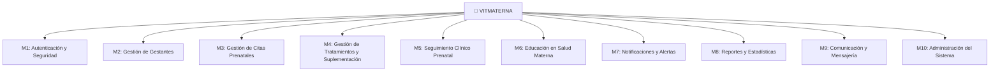

# VITMATERNA — Requerimientos Funcionales y No Funcionales

## Resumen Ejecutivo

**VITMATERNA** es un aplicativo móvil diseñado para mejorar los servicios prenatales en gestantes del Centro de Salud Talavera (Andahuaylas, Apurímac, Perú). Este documento define los requerimientos completos para construir el sistema, basado en el análisis exhaustivo de las siguientes fuentes:

---

## Fuentes Analizadas

| # | Fuente | Tipo | Contenido Clave |
|---|--------|------|-----------------|
| 1 | [PITP1-ES-CRISTHIAN-BERROCAL-2025.docx](file:///c:/Proyectos/vitmaterna/PITP1-ES-CRISTHIAN-BERROCAL-2025.docx) | Tesis de investigación | Marco teórico, problemática, objetivos, hipótesis, variables, instrumentos de evaluación |
| 2 | [hilda gestante.pdf](file:///c:/Proyectos/vitmaterna/hilda%20gestante.pdf) | Historia clínica real (20 págs.) | Datos basales, antecedentes obstétricos, controles prenatales, laboratorio, peso/IMC, visitas domiciliarias, plan de parto, ecografía, odontograma, tamizaje de violencia, SRQ-18, consejería nutricional |
| 3 | [1.jpeg](file:///c:/Proyectos/vitmaterna/1.jpeg) | Notas manuscritas | Datos personales de gestante, antecedentes obstétricos, peso/talla/IMC, hemoglobina por trimestre |
| 4 | [2.jpeg](file:///c:/Proyectos/vitmaterna/2.jpeg) | Notas manuscritas | Trimestres de embarazo, vacunas, frecuencia de controles, ecografías, suplementación, signos de alarma |
| 5 | [3.jpeg](file:///c:/Proyectos/vitmaterna/3.jpeg) | Infografía educativa | Señales de peligro en embarazo, parto, postparto y recién nacido |
| 6 | [prototipo actual.docx](file:///c:/Proyectos/vitmaterna/prototipo%20actual.docx) | Capturas del prototipo actual (10 pantallas) | Panel gestante, panel obstetra, gestión de citas, tratamientos, cronograma, reportes, diagrama de casos de uso |

---

## Actores del Sistema

| Actor | Descripción | Funciones Principales |
|-------|-------------|----------------------|
| **Gestante** | Mujer embarazada registrada en el centro de salud | Ver citas, registrar consumo de suplementos, recibir notificaciones, consultar contenido educativo, reportar signos de alarma |
| **Obstetra** | Personal de salud (obstétrica/obstetra) del centro | Programar citas, registrar asistencia, asignar tratamientos, gestionar gestantes, generar reportes |
| **Administrador** | Responsable del sistema en el centro de salud | Gestionar usuarios, configurar el sistema, acceso a métricas globales |

---

## MÓDULOS DEL SISTEMA

---

## MÓDULO 1: AUTENTICACIÓN Y SEGURIDAD

### Requerimientos Funcionales

| ID | Requerimiento | Prioridad | Descripción Detallada |
|----|--------------|-----------|----------------------|
| **RF-1.01** | Registro de usuario (Gestante) | Alta | La gestante se registra con: DNI (8 dígitos), nombre completo, teléfono celular, contraseña. El sistema valida que el DNI coincida con el registro previo del centro de salud. |
| **RF-1.02** | Registro de usuario (Obstetra) | Alta | El personal de salud se registra con: DNI, nombre completo, COP (Colegio de Obstetras del Perú), teléfono, correo electrónico, contraseña. Requiere validación del administrador. |
| **RF-1.03** | Inicio de sesión | Alta | Login mediante DNI + contraseña. Diferenciación automática de rol (Gestante/Obstetra/Admin). |
| **RF-1.04** | Cierre de sesión | Alta | Cerrar sesión de forma segura, eliminando el token de sesión local. |
| **RF-1.05** | Recuperación de contraseña | Alta | Recuperar contraseña vía SMS al número registrado o correo electrónico (para obstetras). |
| **RF-1.06** | Autenticación biométrica | Media | Permitir acceso con huella dactilar o reconocimiento facial como alternativa a la contraseña (para accesos recurrentes). |
| **RF-1.07** | Sesión persistente con token | Media | Mantener la sesión activa por 30 días con token JWT, para evitar re-login frecuente (considerando que muchas gestantes tienen baja alfabetización digital). |
| **RF-1.08** | Bloqueo por intentos fallidos | Alta | Bloquear la cuenta tras 5 intentos fallidos durante 15 minutos. Notificar a la gestante/obstetra. |

---

## MÓDULO 2: GESTIÓN DE GESTANTES

### Requerimientos Funcionales

| ID | Requerimiento | Prioridad | Descripción Detallada |
|----|--------------|-----------|----------------------|
| **RF-2.01** | Registrar gestante | Alta | El obstetra registra una nueva gestante con todos los datos del formulario de atención prenatal (según la historia clínica analizada): |
| | | | **Datos personales:** Nombre y apellidos, DNI, N° Historia Clínica, fecha de nacimiento, edad, dirección, localidad, departamento/provincia/distrito, teléfono, establecimiento de salud, código SIS, ocupación, estudios (analfabeta/primaria/secundaria/superior/no univ.), estado civil (casada/conviviente/soltera/otro), nombre del padre del RN (esposo) y su DNI (opcional). |
| **RF-2.02** | Registrar antecedentes obstétricos | Alta | Registrar: N° de gestaciones (G), partos vaginales (P), cesáreas (C), abortos (A), nacidos vivos, nacidos muertos, RN de mayor peso, N° de hijos vivos. Gestación anterior: eutócico (parto normal) / distócico (complicación/cesárea) / aborto. |
| **RF-2.03** | Registrar antecedentes familiares y personales | Alta | **Familiares:** Ninguno, alergias, hipertensión, epilepsia, diabetes, enfermedades congénitas, embarazo múltiple, malaria, hipertensión arterial, hipotiroidismo, neoplasia, TBC pulmonar, otros. **Personales:** Ninguno, aborto habitual/recurrente, alcoholismo, alergias a medicamentos, violencia, asma bronquial, cardiopatía, cirugía pélvica uterina, diabetes, eclampsia, enfermedades congénitas/infecciosas, epilepsia, hemorragia, hipertensión arterial, infertilidad, neoplasias, parto prolongado, preeclampsia, premadurez, retención placenta, tabaco, TBC pulmonar, VIH/SIDA, coca, trastornos mentales, otras drogas. |
| **RF-2.04** | Registrar peso, talla e IMC | Alta | Peso habitual (kg), talla (cm). Cálculo automático de IMC = Peso / Talla². Clasificación automática: Bajo (<19), Normal (19-25), Sobrepeso (25-30), Obeso (>30). Con orientación/consejería nutricional según clasificación. |
| **RF-2.05** | Registrar tipo de sangre | Alta | Grupo: A, B, AB, O. Factor Rh: Positivo (+), Negativo (-). Si Rh sensitizado: Sí/No. |
| **RF-2.06** | Registrar vacunas previas y actuales | Alta | Registrar estado de vacunación: Rubeola (Sí/No), Hepatitis B (Sí/No), Papiloma Virus (Sí/No). **Vacunas del embarazo:** Antitetánica/DT (N° dosis, 1ra y 2da, semanas de gestación), DPT (20 sem), COVID-19 (1ra, 2da, 3ra dosis), Fiebre Amarilla (Sí/No/NA), Vacuna Rubeola (Sí/No/NA), Vacuna Hepatitis (Sí/No/NA). |
| **RF-2.07** | Registrar FUM y calcular FPP | Alta | Registrar Fecha de Última Menstruación (FUM). Cálculo automático de Fecha Probable de Parto (FPP) usando la Regla de Naegele: FPP = FUM + 7 días - 3 meses + 1 año. Indicar si hay duda (Sí/No). |
| **RF-2.08** | Registrar ecografías | Alta | Registrar hasta 3 ecografías: ① Genética (13 sem), ② Morfológica (22 sem), ③ Bienestar Fetal (35 sem). Para cada una: semanas de gestación, fecha, resultado, hallazgos. EG por ecografía vs EG por FUR. |
| **RF-2.09** | Buscar gestante | Alta | Buscar gestante por DNI (campo visible en prototipo actual). Mostrar datos resumidos al encontrarla. |
| **RF-2.10** | Actualizar datos de gestante | Media | El obstetra puede editar y actualizar cualquier dato de la gestante. Se registra historial de cambios con fecha y responsable. |
| **RF-2.11** | Registrar fecha probable de parto | Alta | Almacenar y mostrar FPP calculada tanto por FUR como por ecografía (EG × ECO). Alertar cuando se acerque la fecha. |
| **RF-2.12** | Registrar examen físico | Alta | Estado general, estado de hidratación, estado de nutrición, examen clínico general, mamas (sin examen/normal/patológico), cuello uterino, pelvis, odontología. |
| **RF-2.13** | Registrar violencia/género | Alta | Ficha de tamizaje de violencia: Sí/No. Cuestionario estandarizado con puntaje (0-24 puntos). Tamizaje positivo (≥15 pts) / negativo (8 pts). Si positivo → caso confirmado → derivación automática. |

---

## MÓDULO 3: GESTIÓN DE CITAS PRENATALES

> [!IMPORTANT]
> Según la OMS (2016), se requieren al menos **8 controles prenatales**. La frecuencia varía según las semanas de gestación:
> - **Cada mes:** 0 → 32 semanas
> - **Cada 15 días:** 32 → 37 semanas
> - **Semanal:** 37 → 40 semanas
> - **Cada día:** >40 semanas

### Requerimientos Funcionales

| ID | Requerimiento | Prioridad | Descripción Detallada |
|----|--------------|-----------|----------------------|
| **RF-3.01** | Programar cita prenatal (Obstetra) | Alta | El obstetra programa la cita: buscar gestante por DNI → ingresar motivo (ej. "Control prenatal") → seleccionar fecha y hora → crear cita. Estado inicial: "programada". |
| **RF-3.02** | Generar cronograma automático de controles | Alta | Al registrar una gestante, el sistema genera automáticamente el cronograma de 8+ controles según la EG actual y la frecuencia establecida por MINSA: mensual (0-32 sem), quincenal (32-37 sem), semanal (37-40 sem). |
| **RF-3.03** | Ver cronograma de citas (Gestante) | Alta | La gestante visualiza su lista de citas: motivo, fecha, hora, estado (programada/confirmada/asistida/no asistida/reprogramada). Pantalla tipo "Mis Citas" como en el prototipo actual. |
| **RF-3.04** | Ver cronograma de citas (Obstetra) | Alta | La obstetra visualiza todas las citas de todas las gestantes: cronograma general con filtros por fecha, estado, gestante. Pantalla tipo "Cronograma Obstetra". |
| **RF-3.05** | Consultar detalle de cita | Alta | Ver información completa de una cita: motivo, fecha/hora, estado, nombre de la gestante, observaciones, historial de cambios de estado. |
| **RF-3.06** | Confirmar asistencia a cita (Gestante) | Alta | La gestante confirma que asistirá a su cita programada. El estado cambia de "programada" a "confirmada". |
| **RF-3.07** | Registrar asistencia real (Obstetra) | Alta | La obstetra registra si la gestante asistió o no. Botones: "Asistió" / "No asistió". Esto alimenta el indicador de adherencia. |
| **RF-3.08** | Solicitar reprogramación (Gestante) | Alta | La gestante puede solicitar reprogramar una cita indicando un motivo por escrito (campo "Motivo para reprogramar"). La obstetra aprueba/rechaza. |
| **RF-3.09** | Reprogramar cita (Obstetra) | Alta | La obstetra puede reprogramar una cita: seleccionar nueva fecha/hora → guardar reprogramación. Se registra el motivo y se notifica a la gestante. |
| **RF-3.10** | Historial de citas | Media | Registro completo de todas las citas (pasadas y futuras), incluyendo cambios de estado, reprogramaciones y motivos. |
| **RF-3.11** | Recordatorio automático de cita | Alta | El sistema envía recordatorios automáticos antes de cada cita: 3 días antes, 1 día antes, y 2 horas antes. Canales: notificación push + SMS + WhatsApp. |
| **RF-3.12** | Cálculo automático de siguiente cita | Alta | Tras cada control realizado, sugerir automáticamente la fecha del siguiente según la frecuencia correspondiente a la EG actual. |
| **RF-3.13** | Alerta de cita perdida | Alta | Si la gestante no asistió ni reprogramó, generar una alerta al obstetra para seguimiento. Incluir en reporte de gestantes inasistentes. |

---

## MÓDULO 4: GESTIÓN DE TRATAMIENTOS Y SUPLEMENTACIÓN

> [!IMPORTANT]
> Según el protocolo MINSA y las notas clínicas analizadas, los suplementos prenatales obligatorios son:
> - **Ácido Fólico:** 500 mg, 1 tableta/día (desde el inicio hasta la semana 14)
> - **Sulfato Ferroso + Ácido Fólico:** 60 mg + 400 μg, 1 tableta/día (desde sem. 14 hasta finalizar el embarazo). Puede necesitar 2 tabletas si hay anemia.
> - **Carbonato de Calcio:** 500 mg, 2 tabletas/día (desde sem. 20 en adelante)

### Requerimientos Funcionales

| ID | Requerimiento | Prioridad | Descripción Detallada |
|----|--------------|-----------|----------------------|
| **RF-4.01** | Asignar tratamiento a gestante (Obstetra) | Alta | El obstetra asigna suplementos/medicamentos a una gestante: nombre del medicamento, dosis, frecuencia (diario/cada 12h/cada 8h), vía de administración (oral), fecha de inicio, duración, indicaciones especiales (ej. "después de desayunar", "no tomar con lácteos"). |
| **RF-4.02** | Visualizar tratamiento prenatal (Gestante) | Alta | La gestante ve su lista de tratamientos activos. Por cada uno: nombre (Hierro, Calcio, Ácido Fólico, etc.), dosis, frecuencia, % de adherencia (barra de progreso visual). Pantalla tipo "Mi Tratamiento Prenatal" del prototipo. |
| **RF-4.03** | Registrar consumo de suplemento (Gestante) | Alta | La gestante toca "Registrar consumo" para confirmar que tomó su medicamento del día. Se registra fecha y hora exacta. Esto alimenta el % de adherencia. |
| **RF-4.04** | Calcular adherencia automáticamente | Alta | Adherencia (%) = (Días registrados como consumidos / Días totales del tratamiento) × 100. Mostrar visualmente con barra de progreso (colores: verde >80%, amarillo 50-80%, rojo <50%). |
| **RF-4.05** | Consultar historial de suplemento | Media | Ver historial detallado: qué días tomó, qué días omitió, tendencias semanales/mensuales. |
| **RF-4.06** | Recordatorio de toma de medicamento | Alta | Notificaciones diarias a la hora configurada para cada medicamento. Canales: push + SMS + WhatsApp. Si no se registra consumo en 2 horas, reenviar recordatorio. |
| **RF-4.07** | Alertar suplementación según EG | Alta | El sistema sugiere automáticamente al obstetra cuándo iniciar/cambiar suplementos según la edad gestacional: Ácido fólico solo (< 14 sem) → Sulfato ferroso + ácido fólico (14+ sem) → Agregar calcio (20+ sem). |
| **RF-4.08** | Registrar hemoglobina y orientación | Alta | Registrar valores de hemoglobina por trimestre: 1er trim. ≥ 11 gr/dL, 2do trim. ≥ 10.5 gr/dL, 3er trim. ≥ 11 gr/dL. Factor de corrección por altitud automático. Si hemoglobina baja → alerta de anemia → orientación nutricional: alimentos ricos en hierro (carnes, sangrecita, menestras, hígado, pollo, lentejas). |
| **RF-4.09** | Registro de vacunas aplicadas | Alta | Registrar fecha de aplicación de cada vacuna prenatal: DT (20 sem), DPT (20 sem). Estado: pendiente/aplicada/no aplica. Recordatorio cuando se aproxime la semana correspondiente. |
| **RF-4.10** | Modificar/suspender tratamiento | Media | El obstetra puede modificar dosis, frecuencia o suspender un tratamiento. Se registra justificación clínica. |

---

## MÓDULO 5: SEGUIMIENTO CLÍNICO PRENATAL

> [!IMPORTANT]
> Los datos de este módulo se basan en los campos exactos de la Historia Clínica de Atención Prenatal analizada en el PDF (páginas 1-2 del PDF) y las notas manuscritas.

### Requerimientos Funcionales

| ID | Requerimiento | Prioridad | Descripción Detallada |
|----|--------------|-----------|----------------------|
| **RF-5.01** | Registrar control prenatal | Alta | En cada visita, el obstetra registra los datos de la atención prenatal (según el formato oficial del MINSA): |
| | | | - **Fecha y hora** de atención |
| | | | - **Edad gestacional** (semanas) |
| | | | - **Peso** de la madre (kg) |
| | | | - **Temperatura** (°C) |
| | | | - **Presión arterial** (mmHg): sistólica/diastólica |
| | | | - **Pulso materno** (por min.) |
| | | | - **Altura uterina** (cm) |
| | | | - **Situación** (L=Longitudinal, T=Transversa, NA) |
| | | | - **Presentación** (C=Cefálica, P=Pélvica, NA) |
| | | | - **Posición** (D=Derecha, I=Izquierda, NA) |
| | | | - **F.C.F.** — Frecuencia Cardíaca Fetal (por min.) |
| | | | - **Movimiento fetal** (+/++/+++/SM=Sin Movimiento, NA) |
| | | | - **Proteinuria cualitativa** (+/++/+++/NSH=No Se Hizo, NA) |
| | | | - **Edema** (S/E=Sin Edema, +/++/+++) |
| | | | - **Reflejo osteotendinoso** (escala 0-4) |
| | | | - **Examen de pezón** (formado/no formado/sin examen) |
| | | | - **Indicación hierro/ácido fólico** (dosis, estado) |
| | | | - **Indicación calcio** (dosis, estado) |
| | | | - **Indicación ácido fólico solo** (dosis, estado) |
| | | | - **Orientación/consejería** (PF/ITS/nutrición/TBC/no se hizo) |
| | | | - **Ecografía de control** (sem/no se hizo, NA) |
| | | | - **Perfil biofísico** (4,6,8,10 de 10/NSH/NA) |
| | | | - **Fecha de próxima cita** |
| | | | - **Visita domiciliaria** (Sí/No, NA) |
| | | | - **Plan de parto** (control/vista/no se hizo, NA) |
| | | | - **Establecimiento** de la atención |
| | | | - **Responsable** de la atención (nombre + COP) |
| | | | - **Nro. Formato SIS** |
| **RF-5.02** | Gráfica de incremento de peso materno | Alta | Gráfica automática tipo curva que muestra el incremento de peso por semanas de amenorrea (13-39 sem). Mostrar percentiles P25 y P90 de referencia. Alertar si el peso está fuera del rango esperado. |
| **RF-5.03** | Gráfica de altura uterina | Alta | Gráfica automática de altura uterina vs semanas de amenorrea. Rango esperado: 7-39 cm. Alertar si está fuera de rango normal. |
| **RF-5.04** | Registrar exámenes de laboratorio | Alta | Registrar resultados de todos los exámenes prenatales según el formato oficial: |
| | | | - **Hemoglobina 1, 2, 3** (Hb% y fecha) + corrección por altitud |
| | | | - **Hemoglobina de alta** |
| | | | - **Glicemia 1, 2** (Normal/Anormal) |
| | | | - **Tolerancia a glucosa** |
| | | | - **VDRL/RPR 1, 2** (No reactivo/Reactivo) |
| | | | - **FTA Abs, TPHA** |
| | | | - **VIH Prueba Rápida 1, 2** |
| | | | - **Prueba Rápida Hep B 1, 2** |
| | | | - **ELISA** |
| | | | - **IFI/Western Blot, HTLV I** |
| | | | - **TORCH, Gota Gruesa** |
| | | | - **Malaria (Prueba Rápida/Fluorescencia)** |
| | | | - **Examen completo de orina** |
| | | | - **Bacteriuria 1, 2** |
| | | | - **Urocultivo, BK en Esputo, Listeria** |
| | | | - **PAP, IVAA, Colposcopía** |
| **RF-5.05** | Registrar patologías maternas | Media | CIE-10 de patologías diagnosticadas. Máximo 3 patologías activas. Registrar fecha de diagnóstico. |
| **RF-5.06** | Registrar monitoreo de ganancia de peso | Alta | Tabla y gráfica según IOM 2009: peso pregestacional, IMC PG, ganancia esperada. Clasificación: Bajo/Adecuado/Alto. Por cada registro: fecha, semana gestacional, peso (kg), ganancia total, clasificación. |
| **RF-5.07** | Registrar signos y síntomas (Gestante) | Alta | La gestante puede anotar cambios, molestias o signos de alerta desde su app: dolor de cabeza, vómitos, sangrado, hinchazón, fiebre, el bebé no se mueve, pérdida de líquido, dolores intensos, visión borrosa. Envío automático de alerta al obstetra si se reporta signo de peligro. |
| **RF-5.08** | Semáforo de riesgo gestacional | Alta | Clasificación visual automática: 🟢 Verde (embarazo sin riesgo) / 🟡 Amarillo (riesgo moderado) / 🔴 Rojo (alto riesgo). Basado en: edad (<15 o >35), IMC, hemoglobina, presión arterial, antecedentes obstétricos, patologías. |
| **RF-5.09** | Registrar consejería nutricional | Media | Registrar sesiones de consejería: historial alimentario, frecuencia de alimentación, consumo de alimentos de origen animal, menestras, frutas/verduras, sal yodada. Acuerdos y negociaciones con la gestante. Sesiones demostrativas (fecha y responsable). |
| **RF-5.10** | Registrar tamizaje de salud mental (SRQ-18) | Media | Cuestionario SRQ-18 digitalizado: 28 preguntas Sí/No. Cálculo automático de puntaje. Alertar si preguntas 1-18 ≥ 9 (trastorno mental), preguntas 19-22 ≥ 1 (psicótico), pregunta 23 = Sí (convulsivo), preguntas 24-28 ≥ 1 (alcoholismo). Derivación automática si positivo. |
| **RF-5.11** | Registrar tamizaje de violencia | Media | Cuestionario estandarizado digitalizado (8 preguntas, escala 1-3 puntos c/u). Puntaje total automático (8-24). Tamizaje positivo ≥ 15. Si positivo: activar protocolo de derivación y alertar al equipo de salud. |
| **RF-5.12** | Registrar odontograma | Baja | Registro dental básico: estado de salud bucal, caries detectadas, tratamientos realizados. CIE-10: K020, K021, K036. |

---

## MÓDULO 6: EDUCACIÓN EN SALUD MATERNA

### Requerimientos Funcionales

| ID | Requerimiento | Prioridad | Descripción Detallada |
|----|--------------|-----------|----------------------|
| **RF-6.01** | Contenido educativo por trimestre | Alta | Mostrar información segmentada por trimestre del embarazo, en lenguaje sencillo y accesible: |
| | | | **1er Trimestre (1-13 sem):** Importancia del ácido fólico, primeros síntomas del embarazo, alimentación en el primer trimestre, primera ecografía genética (13 sem), tamizajes iniciales. |
| | | | **2do Trimestre (14-27 sem):** Inicio del hierro+ácido fólico (14 sem), ecografía morfológica (22 sem), movimientos fetales, inicio del calcio (20 sem), nutrición y ganancia de peso adecuada. |
| | | | **3er Trimestre (28-40 sem):** Ecografía de bienestar fetal (35 sem), preparación para el parto, plan de parto, signos de alarma pre-parto, lactancia materna, estimulación prenatal, psicoprofilaxis. |
| **RF-6.02** | Señales de peligro del embarazo | Alta | Sección visual con imágenes (basadas en la infografía analizada en 3.jpeg): |
| | | | - Vómitos frecuentes |
| | | | - Dolor de cabeza, fiebre o calentura |
| | | | - Pies, manos o cara hinchada |
| | | | - "Dolores" antes de la fecha de parto e inicio de parto |
| | | | - Pérdida de sangre por sus partes |
| | | | - Pérdida de líquidos por sus partes |
| | | | - La guagua (bebé) no se mueve |
| | | | - La guagua está atravesada |
| **RF-6.03** | Señales de peligro en el parto | Alta | - Pérdida de líquido por más de 6 meses (antes de tiempo) |
| | | | - El niño viene de pies / El niño viene atravesado |
| | | | - Son gemelos/mellizos |
| | | | - Salida de la mano/pie por la vagina |
| | | | - Hemorragia vaginal abundante |
| | | | - Salida del cordón por la vagina |
| | | | - La placenta no sale por más de 30 minutos |
| **RF-6.04** | Señales de peligro después del parto | Alta | - La placenta no sale completa |
| | | | - Sangrado vaginal |
| | | | - Mal olor |
| | | | - Fiebre, escalofríos |
| | | | - Hinchazón y dolor de manos |
| **RF-6.05** | Señales de peligro del recién nacido | Alta | - No quiere mamar |
| | | | - Bajo peso |
| | | | - Pálido o morado |
| | | | - Flácido/laxo |
| **RF-6.06** | Guía de nutrición prenatal | Alta | Información sobre alimentos ricos en: hierro (carnes, sangrecita, hígado, pollo, menestras, lentejas, habas), ácido fólico (espárragos, brócoli, espinacas, naranja, carnes magras), calcio (leche, yogur, queso, sardinas, tofu, brócoli), proteínas (pescados, huevos, maní, menestras, yogurt, quinoa). Con imágenes ilustrativas. |
| **RF-6.07** | Guía de suplementación | Alta | Explicación clara de cada suplemento: por qué lo toma, cuándo tomarlo, efectos secundarios, qué hacer si lo olvida. Con lenguaje sencillo y visual. |
| **RF-6.08** | Contenido multimedia | Media | Videos cortos educativos (máximo 3 min.), audios en quechua y español, infografías descargables. Importante para la población de Apurímac con baja alfabetización. |
| **RF-6.09** | Preguntas frecuentes (FAQ) | Media | Sección de preguntas frecuentes organizadas por categoría: alimentación, suplementos, citas, signos de alarma, parto, lactancia. |
| **RF-6.10** | Calculadora de edad gestacional | Alta | Herramienta interactiva: ingresar FUM → muestra EG actual (semanas + días), trimestre actual, FPP, semanas restantes, y en qué semana se encuentra su bebé con descripción del desarrollo fetal. |

---

## MÓDULO 7: NOTIFICACIONES Y ALERTAS

> [!IMPORTANT]
> Este módulo incorpora **funciones avanzadas** más allá del prototipo actual, incluyendo notificaciones por **WhatsApp** como canal principal de comunicación.

### Requerimientos Funcionales

| ID | Requerimiento | Prioridad | Descripción Detallada |
|----|--------------|-----------|----------------------|
| **RF-7.01** | Notificación push (en-app) | Alta | Notificaciones nativas del sistema operativo Android para todos los eventos: citas, tratamientos, alertas, mensajes. |
| **RF-7.02** | Notificación por SMS | Alta | Envío automático de SMS para recordatorios críticos (citas, alertas de salud). Útil cuando no hay conexión a internet. |
| **RF-7.03** | Notificación por WhatsApp | Alta | **[FUNCIÓN AVANZADA]** Integración con la API de WhatsApp Business para enviar: recordatorios de citas (plantilla con fecha/hora/lugar), recordatorios de medicamentos, alertas de peligro, mensajes educativos semanales según trimestre, confirmación/cancelación de cita con botón de respuesta. |
| **RF-7.04** | Recordatorio de cita prenatal | Alta | Envío automático en 3 momentos: 3 días antes, 1 día antes (10:00 AM), 2 horas antes. Por los 3 canales (push + SMS + WhatsApp). |
| **RF-7.05** | Recordatorio de suplemento diario | Alta | Notificación diaria a la hora configurada por la gestante (ej. 8:00 AM para hierro). Si no confirma toma en 2 horas → reenvío. |
| **RF-7.06** | Alerta de signo de peligro | Alta | Si la gestante reporta un signo de alarma, el sistema envía alerta inmediata al obstetra responsable por push + WhatsApp. Incluye datos de la gestante y síntoma reportado. |
| **RF-7.07** | Alerta de inasistencia | Alta | Si la gestante no asistió a su cita y no reprogramó en 24h → alerta al obstetra → sugerir visita domiciliaria o llamada telefónica. |
| **RF-7.08** | Alerta de baja adherencia | Alta | Si la adherencia al tratamiento cae por debajo del 50% → alerta al obstetra con recomendación de intervención. |
| **RF-7.09** | Mensaje educativo semanal por WhatsApp | Media | **[FUNCIÓN AVANZADA]** Envío semanal automatizado de tips de salud materna según la EG: "Semana 20: Tu bebé ya pesa ~300g. Recuerda iniciar el calcio. ¿Sabías que..." |
| **RF-7.10** | Notificación de resultados de laboratorio | Media | Cuando el obstetra registra nuevos resultados de laboratorio, la gestante recibe notificación de que sus resultados están disponibles. |
| **RF-7.11** | Alerta de exámenes pendientes | Alta | Recordatorio de exámenes de laboratorio que deben realizarse según el protocolo y la EG actual (ej. hemoglobina 2 al 2do trimestre). |
| **RF-7.12** | Alerta de FPP próxima | Alta | Alertas progresivas: 30 días antes, 15 días antes, 7 días antes, 3 días antes de la FPP. Incluir recomendaciones y checklist de preparación. |
| **RF-7.13** | Configuración de preferencias de notificación | Media | La gestante puede configurar: horarios preferidos, canales habilitados (push/SMS/WhatsApp), frecuencia de recordatorios. |
| **RF-7.14** | Notificación al acompañante/familiar | Media | **[FUNCIÓN AVANZADA]** Opcionalmente, enviar notificaciones de citas y alertas al teléfono del acompañante/pareja registrado. |

---

## MÓDULO 8: REPORTES Y ESTADÍSTICAS

### Requerimientos Funcionales

| ID | Requerimiento | Prioridad | Descripción Detallada |
|----|--------------|-----------|----------------------|
| **RF-8.01** | Reporte de asistencia prenatal | Alta | Reporte individual y general de asistencia: N° total de citas programadas, asistidas, no asistidas, reprogramadas. % de cumplimiento por gestante. Listado de gestantes con mayor inasistencia. |
| **RF-8.02** | Reporte de adherencia al tratamiento | Alta | Reporte individual y general: % de adherencia por gestante, por medicamento, por período. Ranking de gestantes con menor adherencia. Tendencias semanales/mensuales. |
| **RF-8.03** | Reporte de adherencia (Gestante) | Alta | La gestante visualiza su propio "Reporte Adherencia" (botón visible en el prototipo actual): calendario visual de consumo de suplementos, % total, racha de días consecutivos. |
| **RF-8.04** | Dashboard del obstetra | Alta | Panel con indicadores clave: total de gestantes activas, citas del día, gestantes en riesgo, alertas pendientes, adherencia promedio, inasistencias recientes. |
| **RF-8.05** | Exportar reporte | Media | Exportar reportes en formato PDF y Excel para presentar al director del centro de salud o para la investigación. |
| **RF-8.06** | Reporte de signos de alarma | Alta | Historial de todos los signos de alarma reportados: gestante, fecha, tipo de signo, acción tomada, tiempo de respuesta. |
| **RF-8.07** | Reporte de indicadores ENDES | Media | **[FUNCIÓN AVANZADA]** Cálculo automático de indicadores alineados con ENDES: % de gestantes con ≥6 controles, % con inicio en 1er trimestre, % con ≥8 controles, cobertura de suplementación. |

---

## MÓDULO 9: COMUNICACIÓN Y MENSAJERÍA

### Requerimientos Funcionales

| ID | Requerimiento | Prioridad | Descripción Detallada |
|----|--------------|-----------|----------------------|
| **RF-9.01** | Chat directo gestante-obstetra | Alta | Canal de mensajería asíncrona dentro de la app para consultas rápidas. Soporte de texto y fotos. Historial de conversaciones. |
| **RF-9.02** | Chatbot de emergencia | Alta | **[FUNCIÓN AVANZADA]** Chatbot automatizado disponible 24/7 que: identifica síntomas reportados, evalúa urgencia (leve/moderada/grave), proporciona indicaciones inmediatas (ej. "Acuda al centro de salud inmediatamente"), alerta al obstetra si es grave, proporciona números de emergencia. |
| **RF-9.03** | Mensajes masivos del obstetra | Media | El obstetra puede enviar mensajes a todas las gestantes o a un grupo filtrado (ej. por trimestre, por riesgo): avisos, cambios de horario, campañas de vacunación, jornadas de salud. |
| **RF-9.04** | Línea de emergencia | Alta | Botón prominente de "EMERGENCIA" en la pantalla principal que: llama directamente al centro de salud, muestra el número de emergencia local, envía ubicación GPS al obstetra. |
| **RF-9.05** | Integración con WhatsApp para consultas | Media | **[FUNCIÓN AVANZADA]** Botón para abrir una conversación de WhatsApp directamente con el obstetra asignado, pre-rellenando el mensaje con datos de la gestante. |

---

## MÓDULO 10: ADMINISTRACIÓN DEL SISTEMA

### Requerimientos Funcionales

| ID | Requerimiento | Prioridad | Descripción Detallada |
|----|--------------|-----------|----------------------|
| **RF-10.01** | Gestión de usuarios | Alta | CRUD de usuarios (crear, ver, editar, deshabilitar). Asignar roles. Aprobar registro de obstetras. |
| **RF-10.02** | Gestión de establecimientos de salud | Media | Registrar datos del establecimiento: nombre, código, dirección, teléfono, horarios, servicios disponibles. |
| **RF-10.03** | Configuración de parámetros del sistema | Media | Configurar: frecuencia de recordatorios, plantillas de mensajes WhatsApp/SMS, valores de referencia de hemoglobina, factor de corrección por altitud, horarios de notificaciones, contenido educativo. |
| **RF-10.04** | Auditoría y logs | Media | Registro de todas las acciones del sistema: quién hizo qué, cuándo, desde dónde. Para trazabilidad y seguridad de datos médicos. |
| **RF-10.05** | Gestión de contenido educativo | Media | CRUD de artículos educativos, infografías, videos. Asignar contenido a trimestres específicos. |
| **RF-10.06** | Backup y restauración de datos | Alta | Respaldo automático diario de la base de datos en la nube. Opción de restauración. |

---

## REQUERIMIENTOS NO FUNCIONALES

### RNF-1: Usabilidad

| ID | Requerimiento | Descripción |
|----|--------------|-------------|
| **RNF-1.01** | Interfaz intuitiva y sencilla | La app debe ser fácil de aprender y usar para gestantes con bajo nivel de alfabetización digital. Botones grandes, iconos claros, colores contrastantes, texto legible (fuente ≥16px). Máximo 3 toques para llegar a cualquier función principal. |
| **RNF-1.02** | Soporte multilingüe | Interfaz disponible en español con terminología sencilla. **[AVANZADO]** Soporte futuro para quechua (variante Chanka, predominante en Apurímac). |
| **RNF-1.03** | Diseño responsive | Adaptable a diferentes tamaños de pantalla de dispositivos Android (desde 5" hasta 7"). |
| **RNF-1.04** | Accesibilidad | Cumplir con estándares de accesibilidad WCAG 2.1 nivel A: contraste de colores, soporte de lectores de pantalla, tamaños de texto ajustables. |
| **RNF-1.05** | Retroalimentación visual | Confirmaciones visuales claras para cada acción (registro exitoso, error, envío de formulario). Indicadores de carga y estados vacíos. |
| **RNF-1.06** | Navegación por roles | Diferenciación clara de las pantallas por rol: Panel Gestante (morado/púrpura como en prototipo) y Panel Obstetra (rosa/magenta como en prototipo). |

### RNF-2: Rendimiento

| ID | Requerimiento | Descripción |
|----|--------------|-------------|
| **RNF-2.01** | Tiempo de respuesta | Cada pantalla debe cargar en menos de 3 segundos con conexión 3G. Operaciones de lectura < 2 seg. Operaciones de escritura < 3 seg. |
| **RNF-2.02** | Funcionamiento offline | **[AVANZADO]** Las funciones críticas deben funcionar sin internet: ver citas, ver tratamientos, contenido educativo, registrar consumo de suplementos. Sincronización automática al recuperar conexión. Esto es crítico para zonas rurales de Apurímac con conectividad intermitente. |
| **RNF-2.03** | Consumo de recursos | La app no debe consumir más de 100 MB de almacenamiento. Consumo de batería mínimo (no ejecutar servicios pesados en segundo plano). |
| **RNF-2.04** | Concurrencia | El backend debe soportar al menos 100 usuarios simultáneos (escalable para replicación en otros centros de salud). |

### RNF-3: Seguridad

| ID | Requerimiento | Descripción |
|----|--------------|-------------|
| **RNF-3.01** | Protección de datos personales | Cumplimiento de la Ley N° 29733 — Ley de Protección de Datos Personales del Perú. Los datos de salud son datos sensibles y requieren consentimiento explícito. |
| **RNF-3.02** | Cifrado de datos | Datos en tránsito cifrados con TLS 1.2+. Datos sensibles almacenados localmente cifrados con AES-256. |
| **RNF-3.03** | Autenticación segura | Tokens JWT con expiración. Contraseñas hasheadas con bcrypt (mínimo 10 salt rounds). |
| **RNF-3.04** | Control de acceso basado en roles | RBAC estricto: cada usuario solo puede acceder a funcionalidades de su rol. Las gestantes solo ven sus propios datos. |
| **RNF-3.05** | Registro de auditoría | Logs de todas las acciones que involucren datos de salud (quién, qué, cuándo). Retención mínima de 5 años. |
| **RNF-3.06** | Consentimiento informado digital | La gestante debe aceptar el consentimiento informado digital al registrarse, indicando cómo se usarán sus datos. |

### RNF-4: Confiabilidad

| ID | Requerimiento | Descripción |
|----|--------------|-------------|
| **RNF-4.01** | Disponibilidad | El sistema debe tener una disponibilidad ≥ 99.5% (tiempo de inactividad máximo de ~3.65 horas/mes). |
| **RNF-4.02** | Recuperación ante fallos | Backup automático diario. Tiempo de recuperación (RTO) < 4 horas. Punto de recuperación (RPO) < 24 horas. |
| **RNF-4.03** | Integridad de datos | Validaciones en frontend y backend para garantizar integridad. Restricciones de base de datos para evitar registros duplicados o inconsistentes. |

### RNF-5: Compatibilidad

| ID | Requerimiento | Descripción |
|----|--------------|-------------|
| **RNF-5.01** | Sistema operativo | Compatible con Android 8.0 (Oreo) o superior. Esto cubre ~95% de dispositivos Android activos en Perú. |
| **RNF-5.02** | Conectividad | Funcional en redes 3G, 4G y WiFi. Modo offline para funciones críticas (ver RNF-2.02). |
| **RNF-5.03** | Integración con WhatsApp | API de WhatsApp Business para envío de mensajes automatizados (requiere número de WhatsApp Business verificado). |
| **RNF-5.04** | Integración con SMS | Gateway de SMS (ej. Twilio, AWS SNS) para envío de recordatorios cuando no hay internet/WhatsApp. |

### RNF-6: Mantenibilidad

| ID | Requerimiento | Descripción |
|----|--------------|-------------|
| **RNF-6.01** | Código modular | Arquitectura por módulos que permita actualizar/agregar funciones sin afectar el sistema completo. |
| **RNF-6.02** | Documentación técnica | Código documentado, API documentada con Swagger/OpenAPI, manual de usuario, manual de administrador. |
| **RNF-6.03** | Actualizaciones remotas | El contenido educativo y los parámetros de configuración deben poder actualizarse desde el backend sin requerir actualización de la app. |

### RNF-7: Portabilidad

| ID | Requerimiento | Descripción |
|----|--------------|-------------|
| **RNF-7.01** | Escalabilidad geográfica | El sistema debe poder replicarse en otros centros de salud con mínima configuración (multi-tenant). |
| **RNF-7.02** | Independencia de infraestructura | Backend desplegable en cualquier proveedor de nube (AWS, GCP, Azure) o servidor local. |

### RNF-8: Funcionalidad (ISO/IEC 25010)

| ID | Requerimiento | Descripción |
|----|--------------|-------------|
| **RNF-8.01** | Completitud funcional | Todas las funciones definidas en los requerimientos funcionales deben estar implementadas antes de la fase de intervención cuasi-experimental. |
| **RNF-8.02** | Corrección funcional | Cálculos automáticos (IMC, EG, FPP, adherencia, hemoglobina corregida por altitud) deben producir resultados correctos con un error < 0.1%. |
| **RNF-8.03** | Adecuación funcional | Las funciones deben satisfacer las necesidades reales del personal de salud y las gestantes del Centro de Salud Talavera. |

---

## Resumen de Datos por Sección de la Gestante

> [!TIP]
> Esta tabla resume **todos los datos** que el sistema necesita capturar, según el análisis de la historia clínica real y las notas manuscritas.

| Sección | Campos de Datos |
|---------|----------------|
| **① Datos Personales** | Nombre y apellidos, DNI, N° Historia Clínica, fecha de nacimiento, edad, dirección, localidad, departamento, provincia, distrito, teléfono, establecimiento, código SIS/ESSALUD, ocupación, nivel de estudios, estado civil, padre del RN (nombre y DNI) |
| **② Antecedentes Obstétricos** | N° embarazos (G), partos (P), vaginales, cesáreas, abortos, nacidos vivos, nacidos muertos, gestación anterior (eutócico → parto normal / distócico → cesárea / aborto), RN mayor peso |
| **③ Peso, Talla e IMC** | Peso habitual (kg), peso actual (kg), talla (cm), IMC calculado. Clasificación: Bajo (<19), Normal (19-25), Sobrepeso (25-30), Obeso (>30). Orientación/consejería nutricional |
| **④ Hemoglobina** | Valor Hb por trimestre: 1er ≥ 11 gr/dL, 2do ≥ 10.5 gr/dL, 3er ≥ 11 gr/dL. Factor corrección altitud. Diagnóstico de anemia (Sí/No). Importancia alimentaria: alimentos ricos en hierro (carnes, sangrecita, menestras, hígado, pollo) |
| **⑤ Trimestres** | I trimestre: ≤ 14 semanas. II trimestre: < 28 semanas. III trimestre: ≥ 28 semanas |
| **⑥ Vacunas** | DT: 20 sem. DPT: 20 sem. COVID: 3 dosis. Fiebre amarilla, Rubeola, Hepatitis B, Papiloma |
| **⑦ Frecuencia de Controles** | Cada mes: 0→32 sem. Cada 15 días: 32→37 sem. Semanal: 37-40 sem. Cada día: >40 sem |
| **⑧ Ecografías** | ① Genética: 13 sem. ② Morfológica: 22 sem. ③ Bienestar Fetal: 35 sem |
| **⑨ Suplementación** | Ácido fólico 500mg 1 tab/día (hasta 14 sem). Sulfato ferroso + ácido fólico 60mg/400μg 1 tab/día (14 sem hasta finalizar, pero puede necesitar 2 tabletas). Carbonato de calcio 500mg 2 tabs/día (desde 20 sem) |
| **⑩ Signos de Alarma** | Vómitos, cefalea, fiebre, edema, dolor, sangrado, pérdida de líquido, bebé no se mueve, bebé atravesado |
| **⑪ Control Prenatal** | Fecha/hora, EG, peso, temperatura, PA, pulso, AU, situación, presentación, posición, FCF, mov. fetal, proteinuria, edema, reflejos, examen de pezón, indicaciones hierro/calcio/ácido fólico, orientación, ecografía, perfil biofísico, próxima cita, responsable, N° SIS |
| **⑫ Laboratorio** | Hemoglobina (3 tomas), glicemia (2 tomas), tolerancia glucosa, VDRL/RPR, VIH, Hep B, ELISA, TORCH, malaria, examen orina, bacteriuria, urocultivo, PAP, IVAA, grupo sanguíneo, tipo Rh |
| **⑬ Consejería Nutricional** | Historial alimentario, frecuencia alimentación, consumo animales/menestras/frutas, sal yodada, acuerdos, sesiones demostrativas |
| **⑭ Salud Mental (SRQ-18)** | 28 preguntas Sí/No, puntaje, diagnóstico, derivación |
| **⑮ Violencia** | 8 preguntas con puntaje (8-24), tamizaje positivo ≥15, derivación |
| **⑯ Odontograma** | Estado dental, caries, tratamientos, CIE-10 |

---

## Funcionalidades Avanzadas (Mejoras sobre el Prototipo Actual)

> [!TIP]
> Estas funciones NO están en el prototipo actual y representan mejoras significativas propuestas:

| # | Funcionalidad Avanzada | Descripción | Beneficio |
|---|----------------------|-------------|-----------|
| 1 | **Notificaciones por WhatsApp** | Integración con WhatsApp Business API para recordatorios, tips educativos y alertas | Mayor alcance: casi todas las gestantes en Perú usan WhatsApp, incluso en zonas rurales |
| 2 | **Chatbot de emergencia 24/7** | Bot automatizado que evalúa síntomas y da orientación inmediata | Respuesta inmediata fuera de horario del centro de salud |
| 3 | **Modo offline** | Funciones críticas sin internet, sincronización posterior | Esencial para zonas rurales con conectividad intermitente |
| 4 | **Notificación a familiar/pareja** | Enviar alertas de citas al acompañante registrado | Mayor compromiso familiar, reducción de inasistencias |
| 5 | **Semáforo de riesgo automático** | Clasificación automática verde/amarillo/rojo | Priorización de gestantes de alto riesgo por el obstetra |
| 6 | **Indicadores ENDES automáticos** | Cálculo de indicadores nacionales de salud materna | Facilita reportes para el MINSA y toma de decisiones |
| 7 | **Contenido en quechua** | Interfaz y contenido educativo bilingüe | Inclusión cultural de gestantes quechuahablantes de Apurímac |
| 8 | **Calculadora de EG interactiva** | Herramienta visual del desarrollo del bebé por semana | Empoderamiento y motivación de la gestante |
| 9 | **Autenticación biométrica** | Huella dactilar / reconocimiento facial | Facilidad de acceso para gestantes con baja alfabetización |
| 10 | **Tamizaje digital SRQ-18 y Violencia** | Cuestionarios digitalizados con cálculo automático | Detección temprana, derivación automática, trazabilidad |

---

## Open Questions

> [!IMPORTANT]
> **Preguntas para definir antes de iniciar el desarrollo:**

1. **¿Qué framework de desarrollo móvil prefieres usar?** (React Native, Flutter, Kotlin nativo, etc.)
2. **¿El backend será con qué tecnología?** (Node.js, Firebase, Django, Spring Boot, etc.)
3. **¿Se requiere versión iOS o solo Android?** La tesis menciona solo Android.
4. **¿Tienes acceso a la API de WhatsApp Business o prefieres usar un servicio alternativo (ej. Twilio)?**
5. **¿Los datos del prototipo actual tienen un backend ya desarrollado o es un prototipo visual?**
6. **¿El factor de corrección de hemoglobina por altitud es fijo (Andahuaylas está a ~2,900 msnm ≈ -1.1 a -1.5 de corrección)?**
7. **¿Se integrará con algún sistema existente del MINSA (HIS, SIS)?**
8. **¿Cuántas gestantes concurrentes se estima que tendrá el sistema inicialmente?** (La tesis indica ~40 gestantes)

---

## Verificación

### Plan de Verificación

| Aspecto | Método | Criterio de Éxito |
|---------|--------|-------------------|
| Funcionalidad completa | Pruebas funcionales por módulo (XP) | 100% de RF implementados y probados |
| Usabilidad | Prueba con 5 gestantes reales del C.S. Talavera | SUS Score ≥ 68 (aceptable) |
| Rendimiento | Pruebas de carga con JMeter/k6 | Respuesta < 3 seg en 3G |
| Seguridad | Análisis de vulnerabilidades (OWASP Top 10) | Sin vulnerabilidades críticas |
| Instrumentos de investigación | Validación con cuestionarios (Instrumentos 1 y 2 de la tesis) | Consistencia interna α ≥ 0.7 |
| Metodología XP | Iteraciones con feedback del personal de salud | Aprobación de cada iteración |
