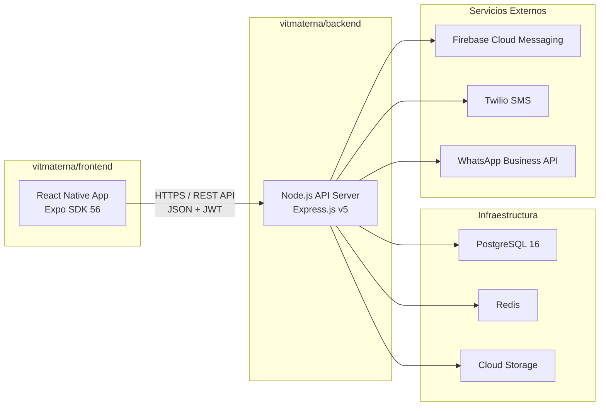
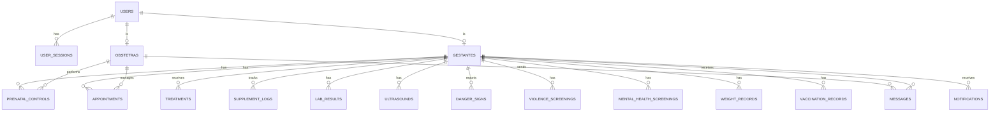
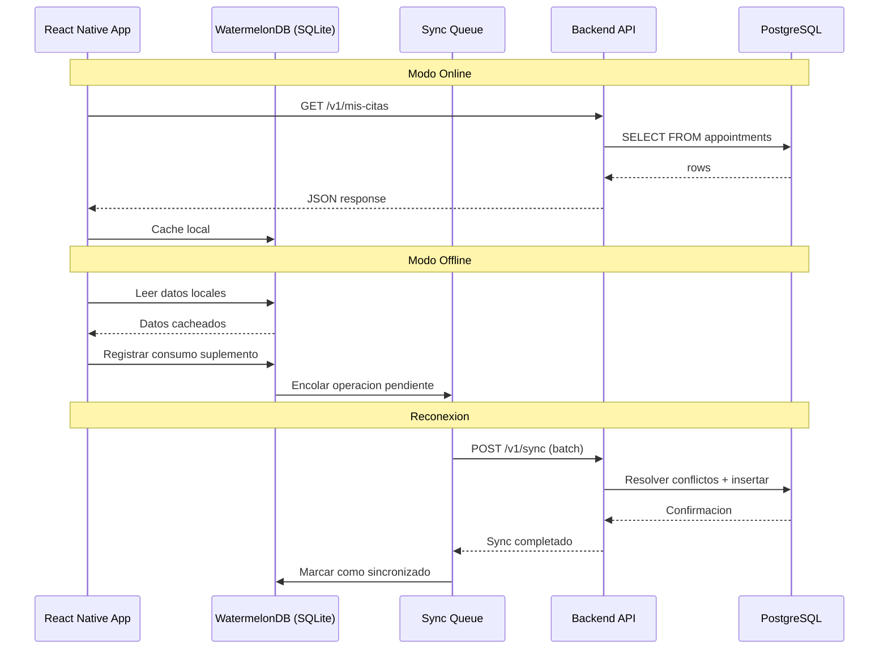
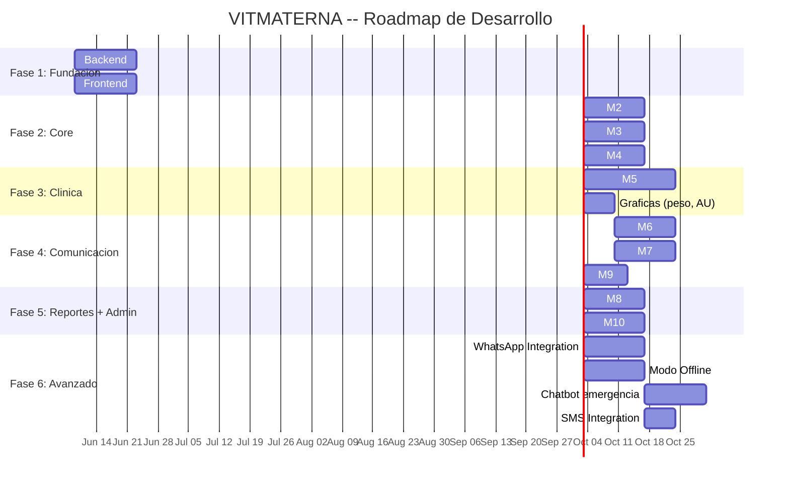

# VITMATERNA -- Product Requirements Document (PRD)

> **Version:** 2.0  
> **Fecha:** 2026-06-07  
> **Stack:** React Native (Expo SDK 56) + Node.js + PostgreSQL  
> **Arquitectura:** Frontend y Backend como carpetas independientes dentro del mismo proyecto, conectados via REST API

---

## 1. Vision del Producto

**VITMATERNA** es una plataforma digital de salud prenatal disenada para mejorar la adherencia a los controles prenatales y la suplementacion en gestantes del Centro de Salud Talavera (Andahuaylas, Apurimac, Peru).

### Problema

- Solo el 49% de gestantes en zonas rurales del Peru completan los 8+ controles prenatales recomendados por la OMS.
- La adherencia a la suplementacion con hierro/acido folico es inferior al 60%.
- Las gestantes de Apurimac enfrentan barreras de conectividad, alfabetizacion digital y acceso geografico.
- Los obstetras carecen de herramientas digitales para seguimiento y alertas tempranas.

### Solucion

Una aplicacion movil (enfoque principal) con soporte web que digitaliza todo el flujo de atencion prenatal: registro clinico, citas, tratamientos, alertas, educacion y reportes.

---

## 2. Arquitectura del Proyecto

> [!IMPORTANT]
> El frontend y el backend viven como **carpetas independientes** dentro del mismo proyecto `vitmaterna/`. Cada uno tiene sus propias dependencias, configuracion y proceso de ejecucion. Se comunican exclusivamente via REST API con contrato OpenAPI.

```
vitmaterna/                     -- Raiz del proyecto
|-- frontend/                   -- React Native (Expo SDK 56)
|-- backend/                    -- Node.js API (Express.js v5)
|-- docs/                       -- Documentacion del proyecto
|-- .gitignore
|-- README.md
```



### Contrato de Comunicacion

| Aspecto | Especificacion |
|---------|---------------|
| **Protocolo** | HTTPS (TLS 1.3) |
| **Formato** | JSON (Content-Type: application/json) |
| **Autenticacion** | Bearer Token (JWT) en header `Authorization` |
| **Documentacion** | OpenAPI 3.1 auto-generada y publicada en `/docs` |
| **Versionamiento** | URL path: `/v1/` |
| **CORS** | Configurado para dominios permitidos |
| **Rate Limiting** | 100 req/min por usuario, 1000 req/min global |

---

## 3. Stack Tecnologico (Versiones Verificadas)

### 3.1 Frontend -- frontend/

| Componente | Tecnologia | Version | Justificacion |
|-----------|-----------|---------|---------------|
| **Runtime** | React Native | 0.85 | Ultima version estable compatible con Expo SDK 56 |
| **Framework** | Expo SDK | 56 | Soporte iOS/Android/Web. OTA updates. Builds en la nube |
| **React** | React | 19.2 | Requerido por Expo SDK 56 |
| **Navegacion** | Expo Router | ~56.x | File-based routing. Deep linking nativo. Soporte web |
| **UI Framework** | @expo/ui | Estable (SDK 56) | Componentes nativos (SwiftUI + Jetpack Compose). Produccion-ready |
| **Iconos** | lucide-react-native | Latest | Iconos SVG profesionales. Tree-shakeable. Requiere react-native-svg |
| **Estado Global** | Zustand | 5.x | Estado UI ligero y performante |
| **Data Fetching** | TanStack Query | 5.x | Cache de servidor, invalidacion, revalidacion automatica |
| **HTTP Client** | Axios | 1.x | Interceptors para JWT, refresh token, retry |
| **DB Local** | WatermelonDB | 0.27+ | Offline-first con sincronizacion incremental |
| **Formularios** | React Hook Form | 7.x | Validacion performante sin re-renders |
| **Validacion** | Zod | 3.x | Schemas compartidos con backend |
| **Graficas** | react-native-chart-kit o Victory Native | Latest | Graficas de peso, altura uterina, adherencia |
| **Notificaciones** | expo-notifications | ~56.x | Push notifications nativas |
| **Storage Seguro** | expo-secure-store | ~56.x | Tokens JWT almacenados de forma segura |
| **Biometria** | expo-local-authentication | ~56.x | Huella dactilar / Face ID |
| **Node.js** | Node.js | >=20.19.4 | Requerido por React Native 0.85 |

### 3.2 Backend -- backend/

| Componente | Tecnologia | Version | Justificacion |
|-----------|-----------|---------|---------------|
| **Runtime** | Node.js | 22 LTS | LTS estable. Soporte largo plazo |
| **Framework HTTP** | Express.js | 5.x | Estable. Middleware ecosystem maduro |
| **ORM** | Prisma | 7.x | Type-safe queries. Migraciones automaticas. Rust-free client |
| **Base de Datos** | PostgreSQL | 16 | JSONB, extensiones, Row-Level Security |
| **Cache/Colas** | Redis | 7.x | Cache de sesiones + BullMQ job queues |
| **Job Queue** | BullMQ | 5.x | Procesamiento async de notificaciones, reportes |
| **Autenticacion** | jsonwebtoken + bcrypt | Latest | JWT stateless + hash de contrasenas |
| **Validacion** | Zod | 3.x | Validacion de entrada en cada endpoint |
| **Documentacion API** | swagger-jsdoc + swagger-ui-express | Latest | OpenAPI 3.1 auto-generada |
| **Logging** | Pino | 9.x | Logging estructurado JSON de alto rendimiento |
| **PDF** | PDFKit | Latest | Generacion de reportes PDF |
| **Testing** | Jest + Supertest | Latest | Unit + Integration tests |
| **TypeScript** | TypeScript | 5.x | Tipado estricto en todo el proyecto |

---

## 4. Estructura de Proyecto -- Frontend

```
vitmaterna/frontend/
|-- app/                                 -- Expo Router (file-based routing)
|   |-- (auth)/                          -- Grupo: pantallas de autenticacion
|   |   |-- login.tsx
|   |   |-- register.tsx
|   |   |-- forgot-password.tsx
|   |   |-- _layout.tsx
|   |
|   |-- (gestante)/                      -- Grupo: pantallas rol gestante
|   |   |-- (tabs)/
|   |   |   |-- _layout.tsx              -- Tab navigator (5 tabs)
|   |   |   |-- index.tsx                -- Inicio / Dashboard
|   |   |   |-- citas.tsx                -- Mis Citas
|   |   |   |-- tratamiento.tsx          -- Mi Tratamiento
|   |   |   |-- educacion.tsx            -- Educacion en Salud
|   |   |   |-- perfil.tsx               -- Mi Perfil
|   |   |-- citas/
|   |   |   |-- [id].tsx                 -- Detalle de cita
|   |   |-- tratamiento/
|   |   |   |-- [id].tsx                 -- Detalle de tratamiento
|   |   |   |-- historial.tsx
|   |   |-- signos-alarma.tsx            -- Reportar signo de alarma
|   |   |-- emergencia.tsx               -- Boton de emergencia
|   |   |-- chat/
|   |   |   |-- index.tsx                -- Lista de conversaciones
|   |   |   |-- [id].tsx                 -- Chat con obstetra
|   |   |-- calculadora-eg.tsx
|   |   |-- reporte-adherencia.tsx
|   |   |-- _layout.tsx
|   |
|   |-- (obstetra)/                      -- Grupo: pantallas rol obstetra
|   |   |-- (tabs)/
|   |   |   |-- _layout.tsx
|   |   |   |-- index.tsx                -- Dashboard obstetra
|   |   |   |-- gestantes.tsx            -- Lista de gestantes
|   |   |   |-- cronograma.tsx           -- Cronograma de citas
|   |   |   |-- alertas.tsx              -- Alertas y notificaciones
|   |   |   |-- perfil.tsx               -- Perfil obstetra
|   |   |-- gestantes/
|   |   |   |-- nueva.tsx                -- Registrar gestante
|   |   |   |-- [id]/
|   |   |       |-- index.tsx            -- Ficha completa
|   |   |       |-- controles.tsx        -- Controles prenatales
|   |   |       |-- nuevo-control.tsx
|   |   |       |-- laboratorio.tsx
|   |   |       |-- ecografias.tsx
|   |   |       |-- tratamientos.tsx
|   |   |       |-- tamizajes.tsx
|   |   |       |-- graficas.tsx         -- Graficas peso/AU
|   |   |-- citas/
|   |   |   |-- nueva.tsx
|   |   |   |-- [id].tsx
|   |   |-- reportes/
|   |   |   |-- asistencia.tsx
|   |   |   |-- adherencia.tsx
|   |   |   |-- signos-alarma.tsx
|   |   |-- chat/
|   |   |   |-- index.tsx
|   |   |   |-- [id].tsx
|   |   |-- _layout.tsx
|   |
|   |-- (admin)/                         -- Grupo: pantallas de admin
|   |   |-- usuarios.tsx
|   |   |-- establecimientos.tsx
|   |   |-- contenido-educativo.tsx
|   |   |-- configuracion.tsx
|   |   |-- auditoria.tsx
|   |   |-- _layout.tsx
|   |
|   |-- _layout.tsx                      -- Root layout
|   |-- index.tsx                        -- Splash / redirect por rol
|
|-- src/
|   |-- components/
|   |   |-- ui/                          -- Componentes base del design system
|   |   |   |-- AppButton.tsx
|   |   |   |-- AppCard.tsx
|   |   |   |-- AppInput.tsx
|   |   |   |-- AppBadge.tsx
|   |   |   |-- ProgressBar.tsx
|   |   |   |-- StatusChip.tsx
|   |   |   |-- EmptyState.tsx
|   |   |   |-- LoadingScreen.tsx
|   |   |   |-- AppHeader.tsx
|   |   |   |-- index.ts
|   |   |-- forms/                       -- Formularios clinicos complejos
|   |   |   |-- GestanteForm.tsx
|   |   |   |-- ControlPrenatalForm.tsx
|   |   |   |-- LaboratorioForm.tsx
|   |   |   |-- TamizajeViolenciaForm.tsx
|   |   |   |-- SRQ18Form.tsx
|   |   |-- charts/                      -- Graficas clinicas
|   |   |   |-- WeightChart.tsx
|   |   |   |-- UterineHeightChart.tsx
|   |   |   |-- AdherenceChart.tsx
|   |   |-- shared/                      -- Componentes de negocio reutilizables
|   |       |-- RiskIndicator.tsx        -- Semaforo verde/amarillo/rojo (sin emojis)
|   |       |-- AppointmentCard.tsx
|   |       |-- TreatmentCard.tsx
|   |       |-- EmergencyButton.tsx
|   |       |-- NotificationBell.tsx
|   |
|   |-- hooks/                           -- Custom hooks
|   |   |-- useAuth.ts
|   |   |-- useGestante.ts
|   |   |-- useAppointments.ts
|   |   |-- useTreatments.ts
|   |   |-- useNotifications.ts
|   |   |-- useOfflineSync.ts
|   |
|   |-- services/                        -- Capa de comunicacion con API
|   |   |-- api.ts                       -- Axios instance (baseURL, interceptors, JWT refresh)
|   |   |-- authService.ts
|   |   |-- gestanteService.ts
|   |   |-- citasService.ts
|   |   |-- treatmentService.ts
|   |   |-- clinicalService.ts
|   |   |-- educationService.ts
|   |   |-- notificationService.ts
|   |   |-- reportService.ts
|   |   |-- messageService.ts
|   |   |-- adminService.ts
|   |
|   |-- store/                           -- Zustand stores
|   |   |-- authStore.ts
|   |   |-- uiStore.ts
|   |   |-- offlineStore.ts
|   |
|   |-- theme/                           -- Design system tokens
|   |   |-- colors.ts
|   |   |-- typography.ts
|   |   |-- spacing.ts
|   |   |-- shadows.ts
|   |   |-- gestanteTheme.ts             -- Tema violeta para gestantes
|   |   |-- obstetraTheme.ts             -- Tema rosa para obstetras
|   |   |-- index.ts
|   |
|   |-- utils/                           -- Utilidades puras
|   |   |-- dateUtils.ts                 -- Calculos FPP, EG, trimestre
|   |   |-- clinicalUtils.ts             -- IMC, hemoglobina corregida
|   |   |-- validators.ts                -- Validacion DNI, telefono
|   |   |-- formatters.ts                -- Formato de fechas, numeros
|   |   |-- constants.ts                 -- Constantes de la app
|   |
|   |-- i18n/                            -- Internacionalizacion
|   |   |-- es.json                      -- Espanol
|   |   |-- qu.json                      -- Quechua (futuro)
|   |
|   |-- types/                           -- TypeScript types/interfaces
|       |-- user.ts
|       |-- gestante.ts
|       |-- appointment.ts
|       |-- treatment.ts
|       |-- clinical.ts
|       |-- api.ts                       -- Tipos de respuesta API
|
|-- assets/                              -- Imagenes, fuentes, iconos estaticos
|-- app.json                             -- Expo config
|-- package.json
|-- tsconfig.json
|-- .env.example                         -- API_BASE_URL, etc.
|-- .eslintrc.js
|-- .prettierrc
|-- metro.config.js
|-- babel.config.js
```

---

## 5. Estructura de Proyecto -- Backend

```
vitmaterna/backend/
|-- src/
|   |-- config/
|   |   |-- app.ts                       -- Express app setup, middlewares globales
|   |   |-- database.ts                  -- Prisma client singleton
|   |   |-- redis.ts                     -- Redis client config
|   |   |-- env.ts                       -- Variables de entorno validadas con Zod
|   |   |-- cors.ts                      -- CORS policy
|   |   |-- swagger.ts                   -- Swagger/OpenAPI config
|   |
|   |-- middleware/
|   |   |-- auth.middleware.ts           -- JWT verification
|   |   |-- rbac.middleware.ts           -- Role-based access control
|   |   |-- validate.middleware.ts       -- Zod validation por endpoint
|   |   |-- rateLimiter.middleware.ts    -- Rate limiting por IP/usuario
|   |   |-- audit.middleware.ts          -- Logging automatico de acciones
|   |   |-- errorHandler.middleware.ts   -- Error handling centralizado
|   |   |-- requestLogger.middleware.ts  -- Log de requests (Pino)
|   |
|   |-- modules/                         -- Modulos por dominio (controller + service + schema + routes)
|   |   |-- auth/
|   |   |   |-- auth.controller.ts
|   |   |   |-- auth.service.ts
|   |   |   |-- auth.schema.ts           -- Zod schemas de validacion
|   |   |   |-- auth.routes.ts
|   |   |
|   |   |-- gestante/
|   |   |   |-- gestante.controller.ts
|   |   |   |-- gestante.service.ts
|   |   |   |-- gestante.schema.ts
|   |   |   |-- gestante.routes.ts
|   |   |
|   |   |-- appointment/
|   |   |   |-- appointment.controller.ts
|   |   |   |-- appointment.service.ts
|   |   |   |-- appointment.schema.ts
|   |   |   |-- appointment.routes.ts
|   |   |
|   |   |-- treatment/
|   |   |   |-- treatment.controller.ts
|   |   |   |-- treatment.service.ts
|   |   |   |-- treatment.schema.ts
|   |   |   |-- treatment.routes.ts
|   |   |
|   |   |-- clinical/
|   |   |   |-- prenatalControl.controller.ts
|   |   |   |-- prenatalControl.service.ts
|   |   |   |-- labResult.controller.ts
|   |   |   |-- labResult.service.ts
|   |   |   |-- screening.controller.ts
|   |   |   |-- screening.service.ts
|   |   |   |-- clinical.schema.ts
|   |   |   |-- clinical.routes.ts
|   |   |
|   |   |-- education/
|   |   |   |-- education.controller.ts
|   |   |   |-- education.service.ts
|   |   |   |-- education.schema.ts
|   |   |   |-- education.routes.ts
|   |   |
|   |   |-- notification/
|   |   |   |-- notification.controller.ts
|   |   |   |-- notification.service.ts
|   |   |   |-- notification.routes.ts
|   |   |   |-- channels/
|   |   |       |-- push.channel.ts      -- Firebase Cloud Messaging
|   |   |       |-- sms.channel.ts       -- Twilio SMS
|   |   |       |-- whatsapp.channel.ts  -- WhatsApp Business API
|   |   |
|   |   |-- report/
|   |   |   |-- report.controller.ts
|   |   |   |-- report.service.ts
|   |   |   |-- report.schema.ts
|   |   |   |-- report.routes.ts
|   |   |
|   |   |-- message/
|   |   |   |-- message.controller.ts
|   |   |   |-- message.service.ts
|   |   |   |-- message.schema.ts
|   |   |   |-- message.routes.ts
|   |   |
|   |   |-- admin/
|   |       |-- admin.controller.ts
|   |       |-- admin.service.ts
|   |       |-- admin.schema.ts
|   |       |-- admin.routes.ts
|   |
|   |-- jobs/                            -- BullMQ workers (background jobs)
|   |   |-- reminder.job.ts              -- Recordatorios de citas (3d, 1d, 2h)
|   |   |-- supplementReminder.job.ts    -- Recordatorios de suplementos
|   |   |-- report.job.ts               -- Generacion de reportes PDF
|   |   |-- sync.job.ts                 -- Sincronizacion offline
|   |   |-- weeklyEducation.job.ts      -- Tips semanales por WhatsApp
|   |   |-- riskEvaluation.job.ts       -- Recalculo periodico de riesgo
|   |
|   |-- utils/
|   |   |-- dateCalc.ts                 -- Calculos FPP, EG (Regla de Naegele)
|   |   |-- hemoglobinCorrection.ts     -- Correccion por altitud
|   |   |-- riskCalculator.ts           -- Semaforo de riesgo automatico
|   |   |-- cronogramaGenerator.ts      -- Generador de cronograma de citas
|   |   |-- pdfGenerator.ts             -- Generacion de PDFs con PDFKit
|   |   |-- responseHelper.ts           -- Formato estandar de respuestas API
|   |
|   |-- types/
|   |   |-- index.ts                    -- Tipos globales
|   |   |-- express.d.ts                -- Extension de tipos Express (req.user)
|   |
|   |-- routes/
|   |   |-- index.ts                    -- Router principal: monta todos los modulos
|   |
|   |-- server.ts                       -- Entry point: arranca Express + jobs
|
|-- prisma/
|   |-- schema.prisma                   -- Prisma schema completo
|   |-- migrations/                     -- Archivos de migracion
|   |-- seed.ts                         -- Datos iniciales (admin, config, contenido educativo)
|
|-- tests/
|   |-- unit/
|   |   |-- utils/
|   |   |-- services/
|   |-- integration/
|   |   |-- auth.test.ts
|   |   |-- gestante.test.ts
|   |   |-- appointment.test.ts
|   |-- e2e/
|   |-- helpers/
|       |-- testDb.ts                   -- DB de pruebas
|       |-- testAuth.ts                 -- Helpers de autenticacion para tests
|
|-- docker-compose.yml                  -- PostgreSQL + Redis para desarrollo local
|-- Dockerfile                          -- Build de produccion
|-- package.json
|-- tsconfig.json
|-- .env.example
|-- .eslintrc.js
|-- .prettierrc
|-- nodemon.json                        -- Hot reload en desarrollo
```

---

## 6. Diseno de Base de Datos (PostgreSQL 16)

### 6.1 Diagrama Entidad-Relacion



### 6.2 Esquema Detallado de Tablas

> [!NOTE]
> Todas las tablas incluyen `id (UUID)`, `created_at`, `updated_at`, `deleted_at` (soft delete). Los campos sensibles se cifran con `pgcrypto`.

---

#### Modulo 1: Autenticacion y Usuarios

```sql
-- Usuarios del sistema (todos los roles)
CREATE TABLE users (
    id              UUID PRIMARY KEY DEFAULT gen_random_uuid(),
    dni             VARCHAR(8) UNIQUE NOT NULL,
    password_hash   TEXT NOT NULL,                      -- bcrypt, 12 salt rounds
    role            VARCHAR(20) NOT NULL CHECK (role IN ('gestante', 'obstetra', 'admin')),
    first_name      VARCHAR(100) NOT NULL,
    last_name       VARCHAR(100) NOT NULL,
    phone           VARCHAR(15),                        -- +51XXXXXXXXX
    email           VARCHAR(255),
    is_active       BOOLEAN DEFAULT true,
    is_verified     BOOLEAN DEFAULT false,
    failed_login_attempts INTEGER DEFAULT 0,
    locked_until    TIMESTAMPTZ,
    last_login_at   TIMESTAMPTZ,
    biometric_enabled BOOLEAN DEFAULT false,
    notification_preferences JSONB DEFAULT '{"push": true, "sms": true, "whatsapp": true}'::jsonb,
    consent_accepted BOOLEAN DEFAULT false,
    consent_date    TIMESTAMPTZ,
    created_at      TIMESTAMPTZ DEFAULT NOW(),
    updated_at      TIMESTAMPTZ DEFAULT NOW(),
    deleted_at      TIMESTAMPTZ
);

CREATE INDEX idx_users_dni ON users(dni) WHERE deleted_at IS NULL;
CREATE INDEX idx_users_role ON users(role) WHERE deleted_at IS NULL;

-- Sesiones activas (JWT refresh tokens)
CREATE TABLE user_sessions (
    id              UUID PRIMARY KEY DEFAULT gen_random_uuid(),
    user_id         UUID NOT NULL REFERENCES users(id),
    refresh_token   TEXT NOT NULL,
    device_info     JSONB,
    ip_address      INET,
    expires_at      TIMESTAMPTZ NOT NULL,
    created_at      TIMESTAMPTZ DEFAULT NOW()
);
```

#### Modulo 2: Gestion de Gestantes

```sql
-- Perfil clinico completo de la gestante
CREATE TABLE gestantes (
    id                  UUID PRIMARY KEY DEFAULT gen_random_uuid(),
    user_id             UUID NOT NULL REFERENCES users(id) ON DELETE CASCADE,
    historia_clinica    VARCHAR(20),
    fecha_nacimiento    DATE NOT NULL,
    age_at_registration INTEGER,
    direccion           TEXT,
    localidad           VARCHAR(100),
    departamento        VARCHAR(50) DEFAULT 'Apurimac',
    provincia           VARCHAR(50) DEFAULT 'Andahuaylas',
    distrito            VARCHAR(50) DEFAULT 'Talavera',
    establecimiento     VARCHAR(100) DEFAULT 'C.S. Talavera',
    codigo_sis          VARCHAR(20),
    ocupacion           VARCHAR(100),
    nivel_estudios      VARCHAR(30) CHECK (nivel_estudios IN (
        'analfabeta', 'primaria', 'secundaria', 'superior', 'no_universitario'
    )),
    estado_civil        VARCHAR(20) CHECK (estado_civil IN (
        'casada', 'conviviente', 'soltera', 'otro'
    )),
    padre_rn_nombre     VARCHAR(200),
    padre_rn_dni        VARCHAR(8),
    acompanante_phone   VARCHAR(15),

    -- Datos Obstetricos
    gestaciones         INTEGER DEFAULT 0,
    partos_vaginales    INTEGER DEFAULT 0,
    cesareas            INTEGER DEFAULT 0,
    abortos             INTEGER DEFAULT 0,
    nacidos_vivos       INTEGER DEFAULT 0,
    nacidos_muertos     INTEGER DEFAULT 0,
    hijos_vivos         INTEGER DEFAULT 0,
    rn_mayor_peso       DECIMAL(5,2),
    gestacion_anterior  VARCHAR(20) CHECK (gestacion_anterior IN (
        'eutocico', 'distocico', 'aborto', 'ninguno'
    )),

    -- Datos Antropometricos
    peso_habitual       DECIMAL(5,2),
    peso_actual         DECIMAL(5,2),
    talla               DECIMAL(5,2),
    imc                 DECIMAL(5,2),
    clasificacion_imc   VARCHAR(20),

    -- Tipo de Sangre
    grupo_sanguineo     VARCHAR(3) CHECK (grupo_sanguineo IN ('A', 'B', 'AB', 'O')),
    factor_rh           VARCHAR(10) CHECK (factor_rh IN ('positivo', 'negativo')),
    rh_sensitizado      BOOLEAN,

    -- Fechas Clave
    fum                 DATE,
    fum_dudosa          BOOLEAN DEFAULT false,
    fpp_fum             DATE,
    fpp_eco             DATE,

    -- Examen Fisico
    estado_general      VARCHAR(50),
    estado_hidratacion  VARCHAR(50),
    estado_nutricion    VARCHAR(50),
    examen_mamas        VARCHAR(30) CHECK (examen_mamas IN (
        'sin_examen', 'normal', 'patologico'
    )),
    cuello_uterino      TEXT,
    pelvis              TEXT,
    odontologia         TEXT,

    -- Riesgo
    nivel_riesgo        VARCHAR(10) DEFAULT 'verde' CHECK (nivel_riesgo IN (
        'verde', 'amarillo', 'rojo'
    )),

    -- Estado
    estado              VARCHAR(20) DEFAULT 'activa' CHECK (estado IN (
        'activa', 'parto', 'puerperio', 'inactiva'
    )),

    created_at          TIMESTAMPTZ DEFAULT NOW(),
    updated_at          TIMESTAMPTZ DEFAULT NOW(),
    deleted_at          TIMESTAMPTZ
);

-- Antecedentes familiares y personales
CREATE TABLE antecedentes (
    id              UUID PRIMARY KEY DEFAULT gen_random_uuid(),
    gestante_id     UUID NOT NULL REFERENCES gestantes(id) ON DELETE CASCADE,
    tipo            VARCHAR(20) NOT NULL CHECK (tipo IN ('familiar', 'personal')),
    condicion       VARCHAR(100) NOT NULL,
    detalle         TEXT,
    created_at      TIMESTAMPTZ DEFAULT NOW()
);

-- Perfil profesional del obstetra
CREATE TABLE obstetras (
    id              UUID PRIMARY KEY DEFAULT gen_random_uuid(),
    user_id         UUID NOT NULL REFERENCES users(id) ON DELETE CASCADE,
    cop             VARCHAR(20) NOT NULL,
    especialidad    VARCHAR(100),
    establecimiento VARCHAR(100) DEFAULT 'C.S. Talavera',
    turno           VARCHAR(20),
    created_at      TIMESTAMPTZ DEFAULT NOW(),
    updated_at      TIMESTAMPTZ DEFAULT NOW()
);
```

#### Modulo 3: Citas Prenatales

```sql
CREATE TABLE appointments (
    id                  UUID PRIMARY KEY DEFAULT gen_random_uuid(),
    gestante_id         UUID NOT NULL REFERENCES gestantes(id),
    obstetra_id         UUID REFERENCES obstetras(id),
    motivo              VARCHAR(200) NOT NULL DEFAULT 'Control prenatal',
    fecha               DATE NOT NULL,
    hora                TIME NOT NULL,
    estado              VARCHAR(20) NOT NULL DEFAULT 'programada' CHECK (estado IN (
        'programada', 'confirmada', 'asistida', 'no_asistida', 'reprogramada', 'cancelada'
    )),
    numero_control      INTEGER,
    eg_semanas          INTEGER,
    motivo_reprogramacion TEXT,
    fecha_reprogramada  DATE,
    hora_reprogramada   TIME,
    observaciones       TEXT,
    es_auto_generada    BOOLEAN DEFAULT false,
    recordatorio_3d     BOOLEAN DEFAULT false,
    recordatorio_1d     BOOLEAN DEFAULT false,
    recordatorio_2h     BOOLEAN DEFAULT false,
    created_at          TIMESTAMPTZ DEFAULT NOW(),
    updated_at          TIMESTAMPTZ DEFAULT NOW(),
    deleted_at          TIMESTAMPTZ
);

CREATE INDEX idx_appointments_gestante ON appointments(gestante_id, fecha);
CREATE INDEX idx_appointments_obstetra ON appointments(obstetra_id, fecha);
CREATE INDEX idx_appointments_estado ON appointments(estado);
```

#### Modulo 4: Tratamientos y Suplementacion

```sql
CREATE TABLE treatments (
    id                  UUID PRIMARY KEY DEFAULT gen_random_uuid(),
    gestante_id         UUID NOT NULL REFERENCES gestantes(id),
    obstetra_id         UUID REFERENCES obstetras(id),
    nombre              VARCHAR(200) NOT NULL,
    tipo                VARCHAR(50) CHECK (tipo IN (
        'acido_folico', 'sulfato_ferroso', 'calcio', 'otro'
    )),
    dosis               VARCHAR(100) NOT NULL,
    frecuencia          VARCHAR(50) NOT NULL,
    via_administracion  VARCHAR(30) DEFAULT 'oral',
    hora_toma           TIME,
    indicaciones        TEXT,
    fecha_inicio        DATE NOT NULL,
    fecha_fin           DATE,
    duracion_dias       INTEGER,
    estado              VARCHAR(20) DEFAULT 'activo' CHECK (estado IN (
        'activo', 'suspendido', 'completado'
    )),
    motivo_suspension   TEXT,
    adherencia_pct      DECIMAL(5,2) DEFAULT 0,
    created_at          TIMESTAMPTZ DEFAULT NOW(),
    updated_at          TIMESTAMPTZ DEFAULT NOW()
);

CREATE TABLE supplement_logs (
    id              UUID PRIMARY KEY DEFAULT gen_random_uuid(),
    treatment_id    UUID NOT NULL REFERENCES treatments(id),
    gestante_id     UUID NOT NULL REFERENCES gestantes(id),
    fecha           DATE NOT NULL,
    hora_registro   TIMESTAMPTZ NOT NULL DEFAULT NOW(),
    tomado          BOOLEAN DEFAULT true,
    notas           TEXT,
    created_at      TIMESTAMPTZ DEFAULT NOW(),
    UNIQUE(treatment_id, fecha)
);

CREATE INDEX idx_supplement_logs_treatment ON supplement_logs(treatment_id, fecha);
```

#### Modulo 5: Seguimiento Clinico

```sql
-- Control prenatal (formato MINSA)
CREATE TABLE prenatal_controls (
    id                  UUID PRIMARY KEY DEFAULT gen_random_uuid(),
    gestante_id         UUID NOT NULL REFERENCES gestantes(id),
    obstetra_id         UUID NOT NULL REFERENCES obstetras(id),
    appointment_id      UUID REFERENCES appointments(id),
    numero_control      INTEGER NOT NULL,
    fecha               TIMESTAMPTZ NOT NULL,
    eg_semanas          INTEGER NOT NULL,
    trimestre           INTEGER CHECK (trimestre IN (1, 2, 3)),
    peso                DECIMAL(5,2),
    temperatura         DECIMAL(4,1),
    presion_sistolica   INTEGER,
    presion_diastolica  INTEGER,
    pulso_materno       INTEGER,
    altura_uterina      DECIMAL(4,1),
    situacion           VARCHAR(5) CHECK (situacion IN ('L', 'T', 'NA')),
    presentacion        VARCHAR(5) CHECK (presentacion IN ('C', 'P', 'NA')),
    posicion            VARCHAR(5) CHECK (posicion IN ('D', 'I', 'NA')),
    fcf                 INTEGER,
    movimiento_fetal    VARCHAR(10) CHECK (movimiento_fetal IN ('+', '++', '+++', 'SM', 'NA')),
    proteinuria         VARCHAR(10) CHECK (proteinuria IN ('+', '++', '+++', 'NSH', 'NA')),
    edema               VARCHAR(10) CHECK (edema IN ('SE', '+', '++', '+++')),
    reflejo_osteotendinoso INTEGER CHECK (reflejo_osteotendinoso BETWEEN 0 AND 4),
    examen_pezon        VARCHAR(20) CHECK (examen_pezon IN ('formado', 'no_formado', 'sin_examen')),
    indicacion_hierro   TEXT,
    indicacion_calcio   TEXT,
    indicacion_acido_folico TEXT,
    orientacion         TEXT[],
    ecografia_control   TEXT,
    perfil_biofisico    VARCHAR(20),
    visita_domiciliaria BOOLEAN,
    plan_parto          VARCHAR(20) CHECK (plan_parto IN ('control', 'vista', 'no_se_hizo', 'NA')),
    proxima_cita        DATE,
    establecimiento     VARCHAR(100),
    responsable         VARCHAR(200),
    nro_formato_sis     VARCHAR(30),
    observaciones       TEXT,
    created_at          TIMESTAMPTZ DEFAULT NOW(),
    updated_at          TIMESTAMPTZ DEFAULT NOW()
);

-- Resultados de laboratorio
CREATE TABLE lab_results (
    id              UUID PRIMARY KEY DEFAULT gen_random_uuid(),
    gestante_id     UUID NOT NULL REFERENCES gestantes(id),
    obstetra_id     UUID REFERENCES obstetras(id),
    tipo_examen     VARCHAR(50) NOT NULL,
    numero_toma     INTEGER DEFAULT 1,
    valor           VARCHAR(50),
    valor_numerico  DECIMAL(10,2),
    valor_corregido DECIMAL(10,2),
    unidad          VARCHAR(20),
    resultado       VARCHAR(30),
    fecha_examen    DATE NOT NULL,
    eg_semanas      INTEGER,
    observaciones   TEXT,
    created_at      TIMESTAMPTZ DEFAULT NOW(),
    updated_at      TIMESTAMPTZ DEFAULT NOW()
);

-- Ecografias
CREATE TABLE ultrasounds (
    id              UUID PRIMARY KEY DEFAULT gen_random_uuid(),
    gestante_id     UUID NOT NULL REFERENCES gestantes(id),
    tipo            VARCHAR(30) NOT NULL CHECK (tipo IN ('genetica', 'morfologica', 'bienestar_fetal')),
    numero          INTEGER CHECK (numero IN (1, 2, 3)),
    eg_semanas      INTEGER,
    eg_por_eco      INTEGER,
    fecha           DATE NOT NULL,
    resultado       TEXT,
    hallazgos       TEXT,
    created_at      TIMESTAMPTZ DEFAULT NOW()
);

-- Registro de peso
CREATE TABLE weight_records (
    id              UUID PRIMARY KEY DEFAULT gen_random_uuid(),
    gestante_id     UUID NOT NULL REFERENCES gestantes(id),
    fecha           DATE NOT NULL,
    eg_semanas      INTEGER NOT NULL,
    peso            DECIMAL(5,2) NOT NULL,
    ganancia_total  DECIMAL(5,2),
    clasificacion   VARCHAR(20) CHECK (clasificacion IN ('bajo', 'adecuado', 'alto')),
    created_at      TIMESTAMPTZ DEFAULT NOW()
);

-- Vacunacion
CREATE TABLE vaccination_records (
    id              UUID PRIMARY KEY DEFAULT gen_random_uuid(),
    gestante_id     UUID NOT NULL REFERENCES gestantes(id),
    vacuna          VARCHAR(50) NOT NULL,
    dosis_numero    INTEGER DEFAULT 1,
    eg_semanas_aplicacion INTEGER,
    fecha_aplicacion DATE,
    estado          VARCHAR(20) DEFAULT 'pendiente' CHECK (estado IN ('pendiente', 'aplicada', 'no_aplica')),
    created_at      TIMESTAMPTZ DEFAULT NOW(),
    updated_at      TIMESTAMPTZ DEFAULT NOW()
);

-- Signos de alarma
CREATE TABLE danger_signs (
    id              UUID PRIMARY KEY DEFAULT gen_random_uuid(),
    gestante_id     UUID NOT NULL REFERENCES gestantes(id),
    tipo_signo      VARCHAR(100) NOT NULL,
    descripcion     TEXT,
    severidad       VARCHAR(20) CHECK (severidad IN ('leve', 'moderado', 'grave')),
    accion_tomada   TEXT,
    respondido_por  UUID REFERENCES obstetras(id),
    tiempo_respuesta_min INTEGER,
    estado          VARCHAR(20) DEFAULT 'pendiente' CHECK (estado IN ('pendiente', 'atendido', 'derivado')),
    fecha_reporte   TIMESTAMPTZ DEFAULT NOW(),
    created_at      TIMESTAMPTZ DEFAULT NOW(),
    updated_at      TIMESTAMPTZ DEFAULT NOW()
);

-- Tamizaje de violencia
CREATE TABLE violence_screenings (
    id              UUID PRIMARY KEY DEFAULT gen_random_uuid(),
    gestante_id     UUID NOT NULL REFERENCES gestantes(id),
    obstetra_id     UUID NOT NULL REFERENCES obstetras(id),
    respuestas      JSONB NOT NULL,
    puntaje_total   INTEGER NOT NULL,
    tamizaje_positivo BOOLEAN NOT NULL,
    derivacion      BOOLEAN DEFAULT false,
    observaciones   TEXT,
    fecha           DATE NOT NULL,
    created_at      TIMESTAMPTZ DEFAULT NOW()
);

-- Tamizaje SRQ-18
CREATE TABLE mental_health_screenings (
    id              UUID PRIMARY KEY DEFAULT gen_random_uuid(),
    gestante_id     UUID NOT NULL REFERENCES gestantes(id),
    obstetra_id     UUID NOT NULL REFERENCES obstetras(id),
    respuestas      JSONB NOT NULL,
    puntaje_p1_18   INTEGER,
    puntaje_p19_22  INTEGER,
    pregunta_23     BOOLEAN,
    puntaje_p24_28  INTEGER,
    resultado       VARCHAR(30),
    derivacion      BOOLEAN DEFAULT false,
    observaciones   TEXT,
    fecha           DATE NOT NULL,
    created_at      TIMESTAMPTZ DEFAULT NOW()
);

-- Patologias maternas (CIE-10)
CREATE TABLE pathologies (
    id              UUID PRIMARY KEY DEFAULT gen_random_uuid(),
    gestante_id     UUID NOT NULL REFERENCES gestantes(id),
    codigo_cie10    VARCHAR(10) NOT NULL,
    descripcion     VARCHAR(200),
    fecha_diagnostico DATE NOT NULL,
    estado          VARCHAR(20) DEFAULT 'activa' CHECK (estado IN ('activa', 'resuelta', 'seguimiento')),
    created_at      TIMESTAMPTZ DEFAULT NOW()
);

-- Consejeria nutricional
CREATE TABLE nutritional_counseling (
    id                  UUID PRIMARY KEY DEFAULT gen_random_uuid(),
    gestante_id         UUID NOT NULL REFERENCES gestantes(id),
    obstetra_id         UUID NOT NULL REFERENCES obstetras(id),
    historial_alimentario TEXT,
    frecuencia_alimentacion INTEGER,
    consumo_animales    BOOLEAN,
    consumo_menestras   BOOLEAN,
    consumo_frutas      BOOLEAN,
    sal_yodada          BOOLEAN,
    acuerdos            TEXT,
    sesion_demostrativa BOOLEAN DEFAULT false,
    fecha_sesion_demo   DATE,
    responsable_demo    VARCHAR(200),
    fecha               DATE NOT NULL,
    created_at          TIMESTAMPTZ DEFAULT NOW()
);

-- Odontograma
CREATE TABLE dental_records (
    id              UUID PRIMARY KEY DEFAULT gen_random_uuid(),
    gestante_id     UUID NOT NULL REFERENCES gestantes(id),
    estado_bucal    VARCHAR(50),
    caries          TEXT,
    tratamientos    TEXT,
    codigo_cie10    VARCHAR(10),
    fecha           DATE NOT NULL,
    created_at      TIMESTAMPTZ DEFAULT NOW()
);
```

#### Modulos 6-10: Educacion, Notificaciones, Mensajeria, Admin

```sql
-- Contenido educativo administrable
CREATE TABLE educational_content (
    id              UUID PRIMARY KEY DEFAULT gen_random_uuid(),
    titulo          VARCHAR(200) NOT NULL,
    contenido       TEXT NOT NULL,
    tipo            VARCHAR(30) CHECK (tipo IN ('articulo', 'infografia', 'video', 'audio', 'faq')),
    categoria       VARCHAR(50) CHECK (categoria IN (
        'nutricion', 'suplementos', 'signos_alarma', 'parto',
        'lactancia', 'cuidado_bebe', 'salud_mental', 'general'
    )),
    trimestre       INTEGER CHECK (trimestre IN (1, 2, 3)),
    semana_inicio   INTEGER,
    semana_fin      INTEGER,
    idioma          VARCHAR(10) DEFAULT 'es',
    media_url       TEXT,
    thumbnail_url   TEXT,
    duracion_min    INTEGER,
    orden           INTEGER DEFAULT 0,
    activo          BOOLEAN DEFAULT true,
    created_at      TIMESTAMPTZ DEFAULT NOW(),
    updated_at      TIMESTAMPTZ DEFAULT NOW()
);

-- Notificaciones
CREATE TABLE notifications (
    id              UUID PRIMARY KEY DEFAULT gen_random_uuid(),
    user_id         UUID NOT NULL REFERENCES users(id),
    tipo            VARCHAR(50) NOT NULL,
    canal           VARCHAR(20) NOT NULL CHECK (canal IN ('push', 'sms', 'whatsapp')),
    titulo          VARCHAR(200),
    mensaje         TEXT NOT NULL,
    datos           JSONB,
    estado          VARCHAR(20) DEFAULT 'pendiente' CHECK (estado IN (
        'pendiente', 'enviada', 'entregada', 'leida', 'fallida'
    )),
    programada_para TIMESTAMPTZ,
    enviada_at      TIMESTAMPTZ,
    leida_at        TIMESTAMPTZ,
    error_detalle   TEXT,
    created_at      TIMESTAMPTZ DEFAULT NOW()
);

CREATE INDEX idx_notifications_user ON notifications(user_id, created_at DESC);

-- Conversaciones
CREATE TABLE conversations (
    id              UUID PRIMARY KEY DEFAULT gen_random_uuid(),
    gestante_id     UUID NOT NULL REFERENCES gestantes(id),
    obstetra_id     UUID NOT NULL REFERENCES obstetras(id),
    ultimo_mensaje  TIMESTAMPTZ,
    created_at      TIMESTAMPTZ DEFAULT NOW()
);

-- Mensajes
CREATE TABLE messages (
    id              UUID PRIMARY KEY DEFAULT gen_random_uuid(),
    conversation_id UUID NOT NULL REFERENCES conversations(id),
    sender_id       UUID NOT NULL REFERENCES users(id),
    contenido       TEXT NOT NULL,
    tipo            VARCHAR(20) DEFAULT 'texto' CHECK (tipo IN ('texto', 'imagen', 'alerta_emergencia')),
    media_url       TEXT,
    leido           BOOLEAN DEFAULT false,
    leido_at        TIMESTAMPTZ,
    created_at      TIMESTAMPTZ DEFAULT NOW()
);

CREATE INDEX idx_messages_conversation ON messages(conversation_id, created_at);

-- Auditoria
CREATE TABLE audit_logs (
    id              UUID PRIMARY KEY DEFAULT gen_random_uuid(),
    user_id         UUID REFERENCES users(id),
    accion          VARCHAR(50) NOT NULL,
    entidad         VARCHAR(50) NOT NULL,
    entidad_id      UUID,
    datos_anteriores JSONB,
    datos_nuevos    JSONB,
    ip_address      INET,
    user_agent      TEXT,
    created_at      TIMESTAMPTZ DEFAULT NOW()
);

CREATE INDEX idx_audit_user ON audit_logs(user_id, created_at DESC);

-- Establecimientos de salud
CREATE TABLE health_facilities (
    id              UUID PRIMARY KEY DEFAULT gen_random_uuid(),
    nombre          VARCHAR(200) NOT NULL,
    codigo          VARCHAR(20),
    direccion       TEXT,
    telefono        VARCHAR(15),
    horarios        JSONB,
    servicios       TEXT[],
    altitud_msnm    INTEGER DEFAULT 2926,
    activo          BOOLEAN DEFAULT true,
    created_at      TIMESTAMPTZ DEFAULT NOW(),
    updated_at      TIMESTAMPTZ DEFAULT NOW()
);

-- Configuracion del sistema
CREATE TABLE system_config (
    id              UUID PRIMARY KEY DEFAULT gen_random_uuid(),
    clave           VARCHAR(100) UNIQUE NOT NULL,
    valor           JSONB NOT NULL,
    descripcion     TEXT,
    updated_by      UUID REFERENCES users(id),
    updated_at      TIMESTAMPTZ DEFAULT NOW()
);
```

---

## 7. Especificacion de API REST

### 7.1 Formato Estandar de Respuesta

**Exito:**
```json
{
  "success": true,
  "data": { ... },
  "meta": {
    "page": 1,
    "limit": 20,
    "total": 150,
    "totalPages": 8
  }
}
```

**Error:**
```json
{
  "success": false,
  "error": {
    "code": "VALIDATION_ERROR",
    "message": "El campo DNI es requerido",
    "details": [...]
  }
}
```

### 7.2 Endpoints por Modulo

#### Autenticacion (M1)

| Metodo | Endpoint | Rol | Descripcion |
|--------|---------|-----|-------------|
| POST | `/v1/auth/register` | Publico | Registro de usuario |
| POST | `/v1/auth/login` | Publico | Login (DNI + password) |
| POST | `/v1/auth/refresh` | Autenticado | Renovar access token |
| POST | `/v1/auth/logout` | Autenticado | Cerrar sesion |
| POST | `/v1/auth/forgot-password` | Publico | Recuperacion de contrasena |
| POST | `/v1/auth/reset-password` | Publico | Establecer nueva contrasena |
| GET | `/v1/auth/me` | Autenticado | Perfil del usuario |
| PATCH | `/v1/auth/me` | Autenticado | Actualizar perfil |

#### Gestion de Gestantes (M2)

| Metodo | Endpoint | Rol | Descripcion |
|--------|---------|-----|-------------|
| POST | `/v1/gestantes` | Obstetra | Registrar nueva gestante |
| GET | `/v1/gestantes` | Obstetra | Listar gestantes (paginado) |
| GET | `/v1/gestantes/:id` | Obstetra | Detalle de gestante |
| GET | `/v1/gestantes/buscar` | Obstetra | Buscar por DNI (?dni=XXX) |
| PATCH | `/v1/gestantes/:id` | Obstetra | Actualizar datos |
| GET | `/v1/gestantes/:id/historial` | Obstetra | Historial completo |
| POST | `/v1/gestantes/:id/antecedentes` | Obstetra | Agregar antecedente |
| GET | `/v1/gestantes/:id/antecedentes` | Obstetra | Listar antecedentes |
| DELETE | `/v1/gestantes/:id/antecedentes/:antId` | Obstetra | Eliminar antecedente |

#### Citas Prenatales (M3)

| Metodo | Endpoint | Rol | Descripcion |
|--------|---------|-----|-------------|
| POST | `/v1/citas` | Obstetra | Crear cita |
| GET | `/v1/citas` | Obstetra | Listar todas las citas (filtros) |
| GET | `/v1/citas/:id` | Obst/Gest | Detalle de cita |
| PATCH | `/v1/citas/:id` | Obstetra | Actualizar cita |
| POST | `/v1/citas/:id/confirmar` | Gestante | Confirmar asistencia |
| POST | `/v1/citas/:id/asistencia` | Obstetra | Registrar asistencia real |
| POST | `/v1/citas/:id/reprogramar` | Obst/Gest | Solicitar/aprobar reprogramacion |
| GET | `/v1/citas/cronograma` | Obstetra | Cronograma general |
| GET | `/v1/mis-citas` | Gestante | Citas de la gestante |
| GET | `/v1/mis-citas/proxima` | Gestante | Proxima cita |

#### Tratamientos (M4)

| Metodo | Endpoint | Rol | Descripcion |
|--------|---------|-----|-------------|
| POST | `/v1/tratamientos` | Obstetra | Asignar tratamiento |
| GET | `/v1/tratamientos` | Obstetra | Listar tratamientos |
| GET | `/v1/tratamientos/:id` | Obst/Gest | Detalle |
| PATCH | `/v1/tratamientos/:id` | Obstetra | Modificar |
| POST | `/v1/tratamientos/:id/suspender` | Obstetra | Suspender |
| POST | `/v1/mis-tratamientos/:id/consumo` | Gestante | Registrar consumo |
| GET | `/v1/mis-tratamientos` | Gestante | Mis tratamientos activos |
| GET | `/v1/mis-tratamientos/:id/historial` | Gestante | Historial de consumo |
| GET | `/v1/mis-tratamientos/:id/adherencia` | Gestante | Porcentaje de adherencia |
| POST | `/v1/gestantes/:id/vacunas` | Obstetra | Registrar vacuna |
| GET | `/v1/gestantes/:id/vacunas` | Obstetra | Estado de vacunacion |
| PATCH | `/v1/gestantes/:id/vacunas/:vacId` | Obstetra | Actualizar vacuna |

#### Seguimiento Clinico (M5)

| Metodo | Endpoint | Rol | Descripcion |
|--------|---------|-----|-------------|
| POST | `/v1/controles-prenatales` | Obstetra | Registrar control |
| GET | `/v1/controles-prenatales` | Obstetra | Listar controles |
| GET | `/v1/controles-prenatales/:id` | Obst/Gest | Detalle |
| PATCH | `/v1/controles-prenatales/:id` | Obstetra | Actualizar |
| POST | `/v1/gestantes/:id/laboratorio` | Obstetra | Registrar lab |
| GET | `/v1/gestantes/:id/laboratorio` | Obst/Gest | Resultados |
| POST | `/v1/gestantes/:id/ecografias` | Obstetra | Registrar ecografia |
| GET | `/v1/gestantes/:id/ecografias` | Obst/Gest | Listar ecografias |
| GET | `/v1/gestantes/:id/peso/grafica` | Obst/Gest | Datos grafica peso |
| GET | `/v1/gestantes/:id/altura-uterina/grafica` | Obst/Gest | Datos grafica AU |
| POST | `/v1/mis-signos-alarma` | Gestante | Reportar signo |
| GET | `/v1/mis-signos-alarma` | Gestante | Historial signos |
| POST | `/v1/gestantes/:id/tamizaje-violencia` | Obstetra | Registrar tamizaje |
| POST | `/v1/gestantes/:id/tamizaje-srq18` | Obstetra | Registrar SRQ-18 |
| GET | `/v1/gestantes/:id/tamizajes` | Obstetra | Historial tamizajes |
| POST | `/v1/gestantes/:id/consejeria-nutricional` | Obstetra | Registrar consejeria |

#### Educacion (M6)

| Metodo | Endpoint | Rol | Descripcion |
|--------|---------|-----|-------------|
| GET | `/v1/educacion` | Autenticado | Listar contenido (filtros) |
| GET | `/v1/educacion/:id` | Autenticado | Detalle |
| GET | `/v1/educacion/signos-alarma` | Autenticado | Senales de peligro |
| GET | `/v1/educacion/nutricion` | Autenticado | Guia nutricional |
| GET | `/v1/educacion/suplementos` | Autenticado | Guia de suplementacion |
| GET | `/v1/educacion/faq` | Autenticado | Preguntas frecuentes |
| GET | `/v1/educacion/calculadora-eg` | Autenticado | Calculadora EG (?fum=) |
| POST | `/v1/admin/educacion` | Admin | Crear contenido |
| PATCH | `/v1/admin/educacion/:id` | Admin | Editar contenido |
| DELETE | `/v1/admin/educacion/:id` | Admin | Eliminar contenido |

#### Notificaciones (M7)

| Metodo | Endpoint | Rol | Descripcion |
|--------|---------|-----|-------------|
| GET | `/v1/mis-notificaciones` | Autenticado | Notificaciones del usuario |
| PATCH | `/v1/mis-notificaciones/:id/leer` | Autenticado | Marcar como leida |
| PATCH | `/v1/mis-notificaciones/leer-todas` | Autenticado | Marcar todas |
| GET | `/v1/mis-notificaciones/no-leidas/count` | Autenticado | Contador |

#### Reportes (M8)

| Metodo | Endpoint | Rol | Descripcion |
|--------|---------|-----|-------------|
| GET | `/v1/reportes/asistencia` | Obstetra | Reporte asistencia |
| GET | `/v1/reportes/adherencia` | Obstetra | Reporte adherencia |
| GET | `/v1/reportes/dashboard` | Obstetra | Dashboard KPIs |
| GET | `/v1/reportes/signos-alarma` | Obstetra | Reporte alertas |
| GET | `/v1/reportes/endes` | Obstetra | Indicadores ENDES |
| GET | `/v1/reportes/exportar` | Obstetra | Exportar PDF/Excel |
| GET | `/v1/mi-reporte-adherencia` | Gestante | Reporte personal |

#### Mensajeria (M9)

| Metodo | Endpoint | Rol | Descripcion |
|--------|---------|-----|-------------|
| GET | `/v1/conversaciones` | Autenticado | Listar conversaciones |
| POST | `/v1/conversaciones` | Autenticado | Crear conversacion |
| GET | `/v1/conversaciones/:id/mensajes` | Autenticado | Mensajes |
| POST | `/v1/conversaciones/:id/mensajes` | Autenticado | Enviar mensaje |
| PATCH | `/v1/conversaciones/:id/mensajes/leer` | Autenticado | Marcar leidos |
| POST | `/v1/emergencia` | Gestante | Alerta de emergencia + GPS |

#### Administracion (M10)

| Metodo | Endpoint | Rol | Descripcion |
|--------|---------|-----|-------------|
| GET | `/v1/admin/usuarios` | Admin | Listar usuarios |
| PATCH | `/v1/admin/usuarios/:id` | Admin | Editar usuario |
| PATCH | `/v1/admin/usuarios/:id/activar` | Admin | Activar/desactivar |
| POST | `/v1/admin/usuarios/:id/aprobar` | Admin | Aprobar obstetra |
| GET | `/v1/admin/establecimientos` | Admin | Listar establecimientos |
| POST | `/v1/admin/establecimientos` | Admin | Crear establecimiento |
| PATCH | `/v1/admin/establecimientos/:id` | Admin | Editar establecimiento |
| GET | `/v1/admin/configuracion` | Admin | Ver configuracion |
| PATCH | `/v1/admin/configuracion` | Admin | Actualizar configuracion |
| GET | `/v1/admin/auditoria` | Admin | Consultar logs |

---

## 8. Diseno UI/UX -- Sistema de Diseno Minimalista

### 8.1 Principios de Diseno

| Principio | Aplicacion |
|-----------|-----------|
| **Minimalismo** | Espacios en blanco generosos. Cada elemento tiene un proposito claro |
| **Claridad** | Tipografia grande (>=16px base). Textos concisos en lenguaje sencillo |
| **Accesibilidad** | Contraste WCAG AA. Botones >=48dp. Soporte de lectores de pantalla |
| **Consistencia** | Design tokens centralizados. Componentes reutilizables |
| **Feedback** | Animaciones sutiles en cada interaccion. Estados de carga y vacio claros |

> [!IMPORTANT]
> **Politica de iconos:** Se usan exclusivamente iconos vectoriales profesionales de la libreria **Lucide** (`lucide-react-native`). Queda prohibido el uso de emojis o caracteres Unicode como iconos en cualquier parte de la interfaz.

### 8.2 Libreria de Iconos: Lucide

```tsx
// Instalacion
// npx expo install lucide-react-native react-native-svg

import { Home, Calendar, Pill, BookOpen, User, Bell,
         AlertTriangle, Heart, Phone, Search, Plus,
         ChevronRight, Check, X, Clock, MapPin,
         Shield, Activity, Baby, Stethoscope,
         FileText, BarChart3, MessageSquare, Settings,
         LogOut, Edit, Trash2, Download, Upload,
         Eye, EyeOff, Lock, Unlock, RefreshCw } from 'lucide-react-native';

// Uso: componentes SVG con props size, color, strokeWidth
<Home size={24} color={colors.primary} strokeWidth={1.5} />
```

### 8.3 Mapeo de Iconos por Funcion

| Funcion | Icono Lucide | Componente |
|---------|-------------|------------|
| Inicio / Dashboard | `Home` | Tab gestante/obstetra |
| Citas | `Calendar` | Tab gestante/obstetra |
| Tratamiento | `Pill` | Tab gestante |
| Educacion | `BookOpen` | Tab gestante |
| Perfil | `User` | Tab gestante/obstetra |
| Gestantes | `Baby` | Tab obstetra |
| Alertas | `Bell` | Tab obstetra |
| Buscar | `Search` | Barra de busqueda |
| Signo de alarma | `AlertTriangle` | Boton de reporte |
| Emergencia | `Phone` | Boton de emergencia |
| Riesgo bajo | `Shield` (verde) | Indicador de riesgo |
| Riesgo moderado | `AlertTriangle` (amarillo) | Indicador de riesgo |
| Riesgo alto | `AlertTriangle` (rojo) | Indicador de riesgo |
| Control prenatal | `Stethoscope` | Seccion clinica |
| Laboratorio | `Activity` | Seccion clinica |
| Reportes | `BarChart3` | Seccion reportes |
| Chat | `MessageSquare` | Mensajeria |
| Configuracion | `Settings` | Admin |
| Cerrar sesion | `LogOut` | Perfil |
| Editar | `Edit` | Acciones CRUD |
| Eliminar | `Trash2` | Acciones CRUD |
| Reloj | `Clock` | Horarios/recordatorios |
| Ubicacion | `MapPin` | Establecimiento |
| Ver/Ocultar | `Eye` / `EyeOff` | Contrasena |

### 8.4 Paleta de Colores

```
PALETA -- GESTANTE (Tema Violeta)
-------------------------------------------------------------
Primary:     #7C3AED (Violet 600)     -- Acciones principales
Primary Lt:  #EDE9FE (Violet 100)     -- Backgrounds sutiles
Primary Dk:  #5B21B6 (Violet 800)     -- Texto sobre fondo claro

PALETA -- OBSTETRA (Tema Rosa)
-------------------------------------------------------------
Primary:     #DB2777 (Pink 600)       -- Acciones principales
Primary Lt:  #FCE7F3 (Pink 100)       -- Backgrounds sutiles
Primary Dk:  #9D174D (Pink 800)       -- Texto sobre fondo claro

COLORES COMUNES
-------------------------------------------------------------
Background:  #FAFAFA                   -- Fondo principal
Surface:     #FFFFFF                   -- Cards, modals
Text:        #1F2937 (Gray 800)       -- Texto primario
Text Sec:    #6B7280 (Gray 500)       -- Texto secundario
Border:      #E5E7EB (Gray 200)       -- Bordes sutiles
Disabled:    #D1D5DB (Gray 300)       -- Elementos deshabilitados

COLORES SEMANTICOS
-------------------------------------------------------------
Success:     #059669 (Emerald 600)    -- Completado, OK
Warning:     #D97706 (Amber 600)      -- Atencion
Danger:      #DC2626 (Red 600)        -- Error, peligro
Info:        #2563EB (Blue 600)       -- Informacion

SEMAFORO DE RIESGO
-------------------------------------------------------------
Risk Green:  #10B981                   -- Sin riesgo
Risk Yellow: #F59E0B                   -- Riesgo moderado
Risk Red:    #EF4444                   -- Alto riesgo
```

### 8.5 Tipografia

```
Fuente principal:  Inter (Google Fonts)
Fuente fallback:   System default

Escala tipografica:
-------------------------------------------------------------
Display:    32px / 40px line-height / Bold (700)
Heading 1:  24px / 32px / SemiBold (600)
Heading 2:  20px / 28px / SemiBold (600)
Heading 3:  18px / 24px / Medium (500)
Body:       16px / 24px / Regular (400)      -- Tamano base
Body Small: 14px / 20px / Regular (400)
Caption:    12px / 16px / Regular (400)
Button:     16px / 24px / SemiBold (600)
```

### 8.6 Espaciado

```
xs:   4px   (0.25rem)
sm:   8px   (0.5rem)
md:   16px  (1rem)
lg:   24px  (1.5rem)
xl:   32px  (2rem)
2xl:  48px  (3rem)
3xl:  64px  (4rem)

Border radius:
sm:   8px    -- Chips, badges
md:   12px   -- Buttons, inputs
lg:   16px   -- Cards
xl:   24px   -- Modals
full: 9999px -- Avatars, pills
```

### 8.7 Componentes @expo/ui

```tsx
// Root layout: envolver en Host
import { Host } from '@expo/ui';

export default function RootLayout() {
  return (
    <Host>
      <Slot />
    </Host>
  );
}

// Componentes nativos disponibles:
import {
  Host,          // Root wrapper obligatorio
  Column,        // Layout vertical
  Row,           // Layout horizontal
  Button,        // Boton nativo (SwiftUI/Jetpack Compose)
  TextInput,     // Input nativo con onValueChange
  Text,          // Texto nativo
  BottomSheet,   // Sheet modal desde abajo
  Picker,        // Selector nativo
  DateTimePicker, // Selector de fecha/hora
  Switch,        // Toggle on/off
  Slider,        // Control deslizante
  ProgressBar,   // Barra de progreso
} from '@expo/ui';

// Drop-in replacements de librerias populares:
import { BottomSheet } from '@expo/ui/community/bottom-sheet';
import { DateTimePicker } from '@expo/ui/community/datetimepicker';
```

### 8.8 Navegacion por Rol

**Gestante -- Bottom Tab Navigation (5 tabs):**

| Tab | Icono Lucide | Pantalla |
|-----|-------------|----------|
| Inicio | `Home` | Dashboard: proxima cita, tratamiento del dia, semana actual |
| Citas | `Calendar` | Lista de citas, cronograma, confirmar/reprogramar |
| Tratamiento | `Pill` | Suplementos activos, boton registrar consumo, % adherencia |
| Educacion | `BookOpen` | Contenido por trimestre, senales de peligro, nutricion, FAQ |
| Perfil | `User` | Datos personales, preferencias, reportes, cerrar sesion |

**Obstetra -- Bottom Tab Navigation (5 tabs):**

| Tab | Icono Lucide | Pantalla |
|-----|-------------|----------|
| Inicio | `Home` | Dashboard: resumen del dia, alertas urgentes, metricas |
| Gestantes | `Baby` | Lista de gestantes, busqueda por DNI, semaforo de riesgo |
| Cronograma | `Calendar` | Calendario de citas, vista dia/semana/mes |
| Alertas | `Bell` | Notificaciones, signos de alarma, inasistencias |
| Perfil | `User` | Perfil, reportes, mensajes, configuracion |

---

## 9. Estrategia Offline-First



| Funcionalidad | Lectura Offline | Escritura Offline |
|--------------|:-:|:-:|
| Ver citas | Si | No |
| Ver tratamientos | Si | No |
| Registrar consumo suplemento | Si | Si (encolado) |
| Contenido educativo | Si (precargado) | No |
| Senales de peligro | Si | No |
| Calculadora EG | Si | N/A |
| Reportar signo alarma | No | Si (envia al reconectar) |
| Chat | No | No |
| Controles prenatales | Si (lectura) | No |

---

## 10. Seguridad

| Capa | Implementacion |
|------|---------------|
| **Transporte** | TLS 1.3. Certificate pinning en app movil |
| **Autenticacion** | JWT Access Token (15 min) + Refresh Token (30 dias) |
| **Almacenamiento tokens** | expo-secure-store (Keychain iOS / Keystore Android) |
| **Contrasenas** | bcrypt con 12 salt rounds |
| **Autorizacion** | RBAC estricto por endpoint |
| **Validacion** | Zod en frontend y backend |
| **Rate Limiting** | express-rate-limit (100 req/min por usuario) |
| **Cifrado en reposo** | pgcrypto AES-256 para campos sensibles |
| **Auditoria** | Logging completo de acciones sobre datos de salud |
| **Biometria** | expo-local-authentication (huella/Face ID) |
| **Cumplimiento legal** | Ley 29733 (Peru). Consentimiento digital. Retencion 5+ anos |

---

## 11. Plan de Entrega por Fases



### Fase 1: Fundacion (Semanas 1-2)

**Backend (vitmaterna-api):**
- Inicializar proyecto Node.js + TypeScript + Express v5
- Configurar Prisma v7 + PostgreSQL 16 (Docker Compose)
- Implementar schema de base de datos completo
- Seed de datos iniciales (admin, establecimiento, config)
- Sistema de autenticacion JWT (login, register, refresh, logout)
- Middleware RBAC
- Middleware de auditoria
- Swagger/OpenAPI auto-generado en `/docs`
- Docker Compose (PostgreSQL + Redis)
- Tests unitarios para utils (FPP, IMC, hemoglobina)

**Frontend (vitmaterna-app):**
- Inicializar proyecto Expo SDK 56 + TypeScript
- Configurar Expo Router ~56.x
- Instalar @expo/ui + lucide-react-native + react-native-svg
- Implementar design system (colors, typography, spacing)
- Configurar Axios con interceptors JWT
- Pantallas: Login, Registro, Recuperacion de contrasena
- Zustand auth store
- Navegacion basica por roles

### Fase 2: Core (Semanas 3-5)

- CRUD completo de gestantes (backend + frontend)
- Formulario de registro con todos los campos clinicos
- Busqueda por DNI
- Calculo automatico de FPP, EG, IMC
- Modulo de citas: crear, listar, confirmar, asistencia
- Cronograma automatico de controles
- Modulo de tratamientos: asignar, visualizar, registrar consumo
- Calculo automatico de adherencia con barra visual
- Dashboard Gestante
- Dashboard Obstetra (basico)

### Fase 3: Clinica (Semanas 6-8)

- Formulario completo de control prenatal (formato MINSA)
- Registro de laboratorio
- Registro de ecografias
- Grafica de ganancia de peso materno (con percentiles)
- Grafica de altura uterina
- Tamizaje de violencia digitalizado
- Tamizaje SRQ-18 digitalizado
- Semaforo de riesgo automatico
- Registro de signos de alarma por gestante
- Registro de vacunas

### Fase 4: Comunicacion (Semanas 9-11)

- Modulo de contenido educativo por trimestre
- Senales de peligro con imagenes
- Guia nutricional y de suplementacion
- FAQ
- Calculadora interactiva de EG
- Notificaciones push (FCM + expo-notifications)
- Recordatorios automaticos de citas y suplementos
- Chat gestante-obstetra
- Boton de emergencia

### Fase 5: Reportes y Admin (Semanas 12-13)

- Dashboard obstetra completo con KPIs
- Reportes de asistencia y adherencia
- Reporte de signos de alarma
- Exportar a PDF
- Panel de administracion
- Gestion de contenido educativo (CRUD)
- Logs de auditoria

### Fase 6: Avanzado (Semanas 14-17)

- Integracion WhatsApp Business API
- Modo offline con WatermelonDB
- Chatbot de emergencia (rule-based)
- Integracion SMS (Twilio)
- Notificacion a familiar/acompanante
- Indicadores ENDES
- Autenticacion biometrica
- Soporte quechua (i18n)
- Testing E2E completo

---

## 12. Testing

| Nivel | Herramienta | Cobertura | Que se Prueba |
|-------|------------|-----------|---------------|
| **Unit** | Jest | >=80% | Utilidades, services, validators |
| **Component** | React Native Testing Library | >=70% | Componentes UI, formularios |
| **Integration** | Supertest + Jest | >=75% | Endpoints API, middleware, DB |
| **E2E** | Maestro (mobile) / Playwright (web) | Flujos criticos | Login, registrar consumo, reportar signo |
| **Manual** | 5 gestantes reales del C.S. Talavera | SUS Score >=68 | Usabilidad |

---

## 13. Deployment

| Entorno | Uso | Base de Datos | URL |
|---------|-----|--------------|-----|
| **Development** | Desarrollo local | PostgreSQL (Docker) | `localhost:3000` (API) / `localhost:8081` (App) |
| **Staging** | QA y pruebas | PostgreSQL (Cloud) | `staging-api.vitmaterna.pe` |
| **Production** | Produccion | PostgreSQL (Managed) | `api.vitmaterna.pe` |

**CI/CD Backend:**
```
Push to main --> Lint + TypeCheck --> Unit Tests --> Build --> Integration Tests --> Deploy Staging
Tag release  --> All above + E2E --> Deploy Production
```

**CI/CD Frontend:**
```
Push to main --> Lint + TypeCheck --> Component Tests --> EAS Build (preview)
Tag release  --> All above --> EAS Build (production) --> Submit to stores
```

---

## 14. Open Questions

> [!IMPORTANT]
> Preguntas que necesitan respuesta antes de comenzar el desarrollo:

1. **WhatsApp Business API**: Tienes acceso a una cuenta de WhatsApp Business API verificada, o prefieres usar un proveedor como Twilio para WhatsApp?

2. **Hosting / Cloud Provider**: Tienes preferencia de proveedor de nube (AWS, GCP, DigitalOcean, Railway, Render)? Esto afecta costos y configuracion.

3. **iOS**: React Native soporta iOS nativamente. Quieres incluir iOS desde el inicio o solo Android + Web?

4. **Factor de correccion de hemoglobina**: Andahuaylas esta a ~2,926 msnm. El factor de correccion es fijo (-1.3 segun tablas del MINSA) o debe ser configurable por establecimiento?

5. **Datos del prototipo existente**: El prototipo actual, tiene un backend funcional o es solo diseno visual?

6. **Multi-tenancy**: El sistema debe soportar multiples establecimientos de salud desde el inicio, o solo el C.S. Talavera?

7. **Presupuesto de servicios externos**: Hay presupuesto para servicios pagos (Twilio SMS ~$0.01/SMS, WhatsApp API ~$0.005/msg, Cloud hosting ~$20-50/mes)?

---

## 15. Verificacion

### Backend
```bash
cd backend
npm test                    # Unit + Integration tests
npm run test:e2e            # E2E API tests
npm run lint                # ESLint
npm run typecheck           # TypeScript strict
```

### Frontend
```bash
cd frontend
npm test                    # Component tests
npx maestro test            # E2E mobile tests
npm run lint
npm run typecheck
```
